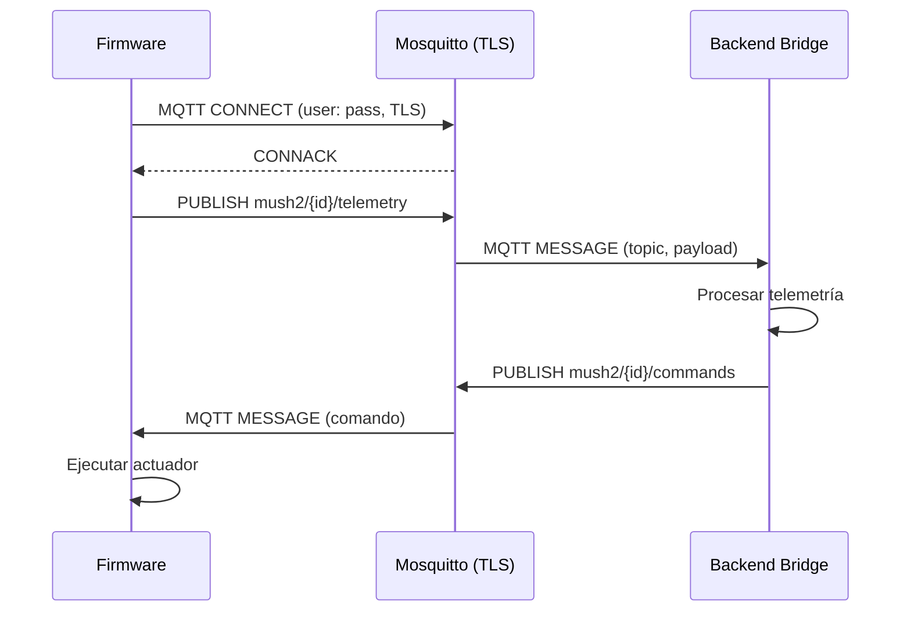

# ADR-023: Infraestructura MQTT Segura

**Estado:** Aceptado  
**Fecha:** 2026-07-23  
**Decisión:** Implementar MQTT seguro con TLS vía WiFiClientSecure (CA root embebida), autenticación por user/password por dispositivo, y ACLs por topic, manteniendo el broker como componente desplegable independiente del backend.

---

## Contexto

El sistema actual opera con MQTT en texto plano:

- **Broker público**: `test.mosquitto.org:1883` (sin autenticación, sin TLS)
- **Topics predecibles**: `mush2/{deviceId}/telemetry`, `mush2/{deviceId}/status`
- **Sin ACLs**: Cualquier cliente puede suscribirse a cualquier topic
- **Sin autenticación**: No hay user/password ni certificados de cliente

En producción esto permite:
1. Intercepción de telemetría (datos de cultivo)
2. Inyección de comandos falsos (activar calefacción/remoción sin autorización)
3. Suplantación de dispositivos

### Estado actual del firmware

- Conexión MQTT en `mqttBridge.js` usa `mqtt` npm package
- Firmware no implementa MQTT directamente; el bridge actúa de intermediario
- `MQTT_BROKER_URL` hardcodeado en código fuente del bridge

---

## Decisión

### 1. Arquitectura MQTT Segura

```
Firmware (ESP32-S3)
  │
  │ WiFiClientSecure
  │ Puerto 8883 (MQTTS)
  │ CA Root embebida
  │ User/Password por deviceId
  ↓
Mosquitto Broker (Docker)
  ├── TLS termination (puerto 8883)
  ├── Autenticación (auth_plugin o config)
  ├── ACLs por topic
  └── Persistence (SQLite o memory)
  │
  │ MQTT over TLS
  │ Puerto 8883
  ↓
Backend (mqttBridge.js)
  ├── Conexión con credenciales
  ├── Subscribe a topics autorizados
  └── Publica comandos con autenticación
```

### 2. TLS en el Firmware

| Componente | Implementación | Notas |
|------------|----------------|-------|
| Librería | `WiFiClientSecure` (ESP-IDF) | Incluida en platformio |
| CA Root | `const char CA_ROOT[]` en `config.h` | Embebida en flash (3KB) |
| Verificación | `setCACert(CA_ROOT)` + `setVerification(WIFISSL_VERIFY)` | Nunca `setInsecure()` en producción |
| Modo desarrollo | `#ifdef DEBUG → setInsecure()` | Compilar con `-DDEBUG` para desactivar verificación |
| RAM estimada | ~30-40KB para buffer TLS | Aceptable en ESP32-S3 (heap ~200-320KB) |

**CA Root:** ISRG Root X1 (Let's Encrypt), válida hasta 2035. Renovación de leaf certs transparente al firmware.

**Regla:** El firmware permite actualizar la CA root via OTA. No es obligatorio; es que el diseño no lo imposibilite.

### 3. Autenticación

| Método | Firmware | Backend | Broker |
|--------|----------|---------|--------|
| User/Password | `{deviceId}:{deviceSecret}` | `{brokerUser}:{brokerPass}` | `password_file` |
| Rate limiting | Exponencial backoff | `express-rate-limit` | `max_connections` por client |
| Rotación | Manual (OTA) | Variables de entorno | Config file |

**Formato de credenciales:**
```
#mosquitto/password_file
mush2_s3_001:$7$10$salted_hashAquí
mush2_s3_002:$7$10$salted_hashAquí
backend_bridge:$7$10$salted_hashAquí
```

### 4. ACLs

| Topic | Firmware | Backend | Descripción |
|-------|----------|---------|-------------|
| `mush2/{deviceId}/telemetry` | W | R | Datos de sensores |
| `mush2/{deviceId}/status` | W | R | Estado del dispositivo |
| `mush2/{deviceId}/commands` | R | W | Comandos de actuadores |
| `mush2/{deviceId}/config` | R | W | Configuración OTA |
| `mush2/system/alerts` | R | W | Alertas globales |

**Configuración Mosquitto:**
```
# /mosquitto/config/acl.conf
pattern readwrite mush2/%c/telemetry
pattern readwrite mush2/%c/status
pattern readwrite mush2/%c/commands
pattern readwrite mush2/%c/config
pattern readwrite mush2/system/alerts
```

Donde `%c` = client_id (deviceId).

### 5. Comportamiento ante Fallo TLS

```text
Boot
  ↓
WiFi Connect
  ↓
MQTT TLS Connect (puerto 8883)
  ↓
¿Error?
  ↓ Sí
Reintento exponencial (5s → 10s → 30s → 60s → 300s max)
  ↓
¿10+ fallos consecutivos?
  ↓ Sí
Modo offline: seguir controlando cámara con última receta conocida
  ↓
Reintentar cada 5 min
```

**Principio:** Nunca dejar de controlar la cámara por un problema de conectividad MQTT.

### 6. Seguridad del Backend → Broker

| Campo | Valor |
|-------|-------|
| URL | `mqtts://mqtt.mush2.cl:8883` (via env `MQTT_BROKER_URL`) |
| Auth | `backend_bridge:{MQTT_BROKER_PASS}` (via env) |
| TLS | CA del sistema operativo (no embebida en Node.js) |
| Reconnect | `reconnectPeriod: 5000` (5s) |
| Clean | `clean: true` |

---

## Alternativas Consideradas

| Opción | Pros | Contras | Descartado por |
|--------|------|---------|----------------|
| Mutual TLS (mTLS) | Máxima seguridad | Gestión de certificados compleja; firmware no soporta fácilmente | Complejidad operativa |
| JWT sobre MQTT | Estándar | Requiere broker con plugin; más overhead | No todos los brokers lo soportan |
| Sin TLS (solo auth) | Simple | Datos en texto plano; vulnerable a MITM | Inaceptable en producción |

---

## Consecuencias

### Positivas
- Autenticación fuerte por dispositivo
- Cifrado end-to-end (firmware ↔ broker)
- ACLs granulares por topic
- Renovación transparente de certificados

### Negativas
- ~30-40KB RAM adicional en firmware para TLS
- Complejidad operativa: gestión de password_file y ACLs
- Broker requiere configuración personalizada (Docker)

---

## Implementación

| Archivo / Módulo | Cambio |
|------------------|--------|
| `firmware/src/config.h` | Agregar `CA_ROOT[]`, `MQTT_USER`, `MQTT_PASS` |
| `firmware/src/mqtt_bridge.h` | Implementar `WiFiClientSecure` con verificación |
| `backend/src/config/env.js` | Agregar `MQTT_BROKER_PASS` |
| `backend/src/services/mqttBridge.js` | Actualizar conexión con credenciales |
| `docker/mosquitto/mosquitto.conf` | Configurar TLS, password_file, ACLs |
| `docker/mosquitto/password_file` | Credenciales de dispositivos |

---

## Roadmap / Plan de Migración

```
Fase 1: Broker seguro (Docker)
├── Mosquitto con TLS habilitado (puerto 8883)
├── Password file con credenciales
├── ACLs por topic
└── Test de conectividad

Fase 2: Backend bridge
├── mqttBridge.js con credenciales
├── Conexión con TLS (CA del sistema)
└── Tests de backward compatibility

Fase 3: Firmware
├── WiFiClientSecure con CA root embebida
├── Autenticación user/password
├── Comportamiento ante fallo TLS
└── Test en hardware real
```

---

## Diagramas



---

## Reglas de Diseño

| ID | Regla | Severidad |
|----|-------|-----------|
| ADR-023-R01 | TLSVerify siempre habilitado excepto con flag DEBUG explícito | HIGH |
| ADR-023-R02 | CA root embebida en firmware, no descargada dinámicamente | HIGH |
| ADR-023-R03 | Credenciales por dispositivo, nunca shared secret | HIGH |
| ADR-023-R04 | Firmware sigue operando en modo offline si TLS falla | MEDIUM |

---

## Referencias

- `RFC-0001` — Estrategia de Seguridad TLS (general)
- `ADR-024` — Estrategia de Despliegue HTTPS
- `ADR-013` — Estrategia de Seguridad general
- `docs/protocol/protocol-v1.md` — Protocolo MQTT actual
- `mosquitto.conf` — Configuración del broker

---

## Historial de Cambios

| Versión | Fecha      | Autor            | Cambios                          |
| ------- | ---------- | ---------------- | -------------------------------- |
| 1.0     | 2026-07-23 | Alejandro Maturana | Creación del documento (ACEPTADO) |

---

*Documento generado como parte del proceso de Architecture Decision Records de Mush2.*
