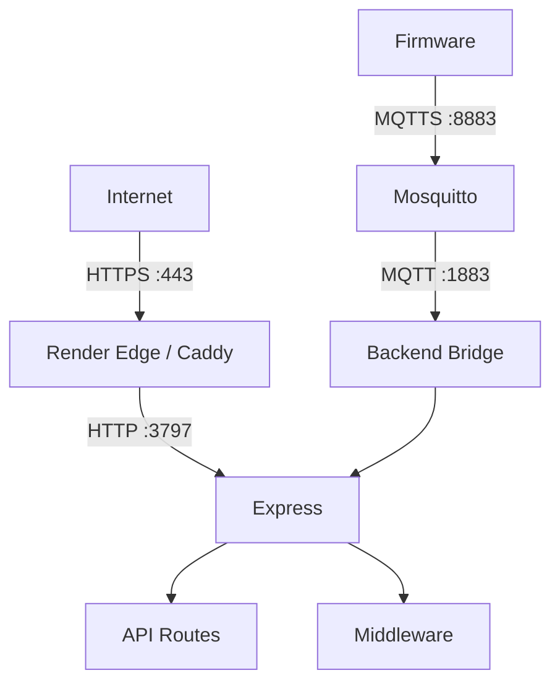

# ADR-024: Estrategia de Despliegue HTTPS

**Estado:** Aceptado  
**Fecha:** 2026-07-23  
**Decisión:** La terminación TLS pertenece a la infraestructura, no al backend Express. El backend opera sobre HTTP interno (puerto 3797) y la capa de TLS se gestiona externamente según el entorno de despliegue.

---

## Contexto

El sistema actual opera sin HTTPS:

- **Backend**: Express en `http.createServer(app, { port: PORT })` — HTTP plano
- **Puerto**: 3797 (configurable via `PORT`)
- **Deployment**: Render.com con edge TLS automático
- **Desarrollo local**: HTTP en `localhost`

En Render.com, la terminación TLS ya está activa en el edge. El problema es cuando se despliega en VPS o infraestructura propia.

---

## Decisión

### 1. Principio: TLS en la Infraestructura

Express **nunca** termina TLS directamente. La responsabilidad es de la capa de infraestructura:

| Entorno | Terminación TLS | Puerto interno | Puerto externo |
|---------|-----------------|----------------|----------------|
| Render | Edge TLS automático | 3797 (HTTP) | 443 (HTTPS) |
| VPS (producción) | Reverse proxy (Caddy) | 3797 (HTTP) | 443 (HTTPS) |
| Docker local | HTTP o HTTPS opcional | 3797 | 3797 |
| Desarrollo | Sin TLS | 3797 | — |

### 2. Arquitectura

```
Internet
  │
  │ HTTPS (443)
  ↓
Render Edge / Caddy Reverse Proxy
  │
  │ HTTP (3797)
  ↓
Express (Node.js)
  ├── API REST
  ├── WebSocket (si aplica)
  └── Middleware (auth, validation)
```

**Express nunca ve tráfico HTTPS.** Recibe HTTP del proxy.

### 3. Reverse Proxy (VPS)

Para VPS se recomienda **Caddy** (no Nginx):

| Característica | Caddy | Nginx |
|----------------|-------|-------|
| Auto-renew Let's Encrypt | Sí (built-in) | No (requiere certbot) |
| Configuración | Simple (`Caddyfile`) | Compleja (`nginx.conf`) |
| Mantenimiento | Mínimo | Requiere renewals manuales |
| TLS config | Automática | Manual |

**Caddyfile mínimo:**
```
mush2.cl {
    reverse_proxy localhost:3797
}
```

**Razón:** La terminación TLS es responsabilidad del proxy, no de la aplicación.

### 4. Firmware → Backend HTTPS

Cuando el firmware necesita comunicarse con el backend (fuera del MQTT):

| Campo | Valor |
|-------|-------|
| URL | `https://api.mush2.cl` (via `BACKEND_URL` en `config.h`) |
| Puerto | 443 (HTTPS) |
| TLS_VERIFY | `WIFISSL_VERIFY` (producción) o `setInsecure()` (DEBUG) |
| CA | CA del sistema (o embebida si se requiere) |

**Nota:** La mayoría de las comunicaciones van por MQTT (ADR-023). HTTPS al backend es solo para endpoints REST que no están cubiertos por MQTT (login, refresh token, etc.).

### 5. Puertos

| Servicio | Puerto | Protocolo | Exposición |
|----------|--------|-----------|------------|
| Backend API | 3797 | HTTP | Interna (proxy) |
| MQTT Broker | 8883 | MQTTS | Externa (firmware) |
| MQTT Broker | 1883 | MQTT | Interna (bridge, solo Docker) |

---

## Alternativas Consideradas

| Opción | Pros | Contras | Descartado por |
|--------|------|---------|----------------|
| Express con `https.createServer` | Todo junto | Acoplamiento; Express gestiona cert; hardcodear key/cert path | Separación de responsabilidades |
| TLS en cada instancia (Load Balancer passthrough) | Simple para ELB | No funciona en Render ni VPS con Caddy | No portable |
| Sin TLS (HTTP plano) | Sin cambios | Inseguro en producción | Riesgo de seguridad |

---

## Consecuencias

### Positivas
- Express se enfoca en lógica de negocio, no en cifrado
- TLS automático en Render; mínimo mantenimiento en VPS (Caddy)
- Fácil de migrar entre entornos (solo cambiar proxy)

### Negativas
- VPS requiere configurar reverse proxy (Caddy)
- No hay HTTPS en desarrollo local (aceptable)

---

## Implementación

| Archivo / Módulo | Cambio |
|------------------|--------|
| `backend/src/server.js` | Sin cambios (ya usa HTTP) |
| `docker-compose.yml` | Agregar servicio Caddy (si aplica) |
| `Caddyfile` | Configuración mínima de reverse proxy |
| `render.yaml` | Verificar que Render maneja TLS automáticamente |

---

## Roadmap / Plan de Migración

```
Fase 1: Render (ya activo)
├── Edge TLS automático de Render
└── Verificar configuración actual

Fase 2: VPS (futuro)
├── Configurar Caddy reverse proxy
├── Configurar DNS (api.mush2.cl → VPS)
└── Test de HTTPS externo
```

---

## Diagramas



---

## Reglas de Diseño

| ID | Regla | Severidad |
|----|-------|-----------|
| ADR-024-R01 | Express nunca termina TLS directamente | HIGH |
| ADR-024-R02 | TLS es responsabilidad de la infraestructura (proxy/edge) | HIGH |
| ADR-024-R03 | Backend siempre escucha HTTP en puerto interno | MEDIUM |

---

## Referencias

- `RFC-0001` — Estrategia de Seguridad TLS
- `ADR-023` — Infraestructura MQTT Segura
- `backend/src/server.js` — Express server (HTTP)
- `render.yaml` — Configuración de Render
- `docs/operations/deployment.md` — Despliegue actual

---

## Historial de Cambios

| Versión | Fecha      | Autor            | Cambios                          |
| ------- | ---------- | ---------------- | -------------------------------- |
| 1.0     | 2026-07-23 | Alejandro Maturana | Creación del documento (ACEPTADO) |

---

*Documento generado como parte del proceso de Architecture Decision Records de Mush2.*
