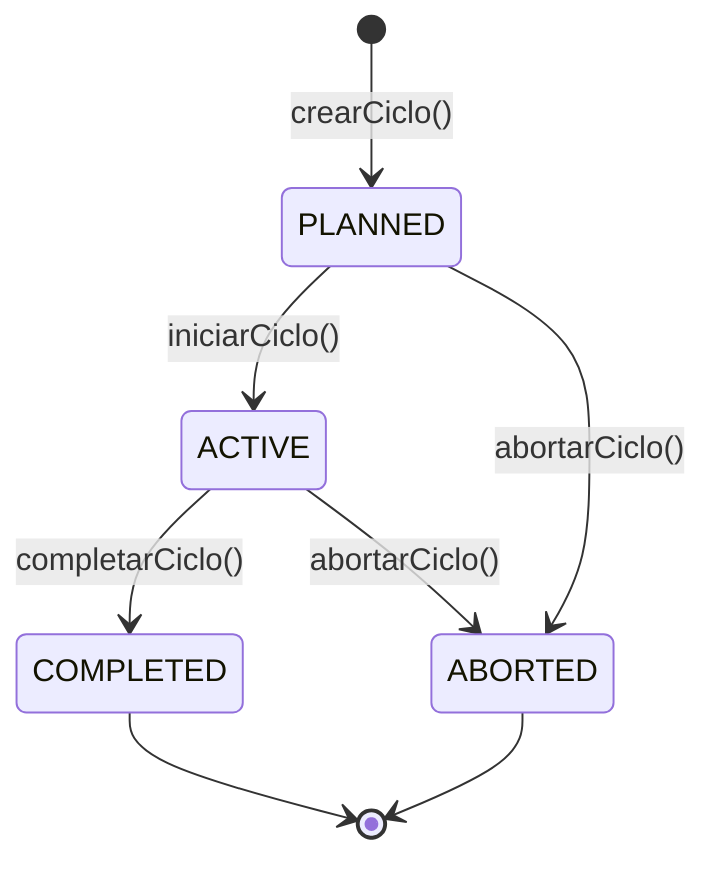
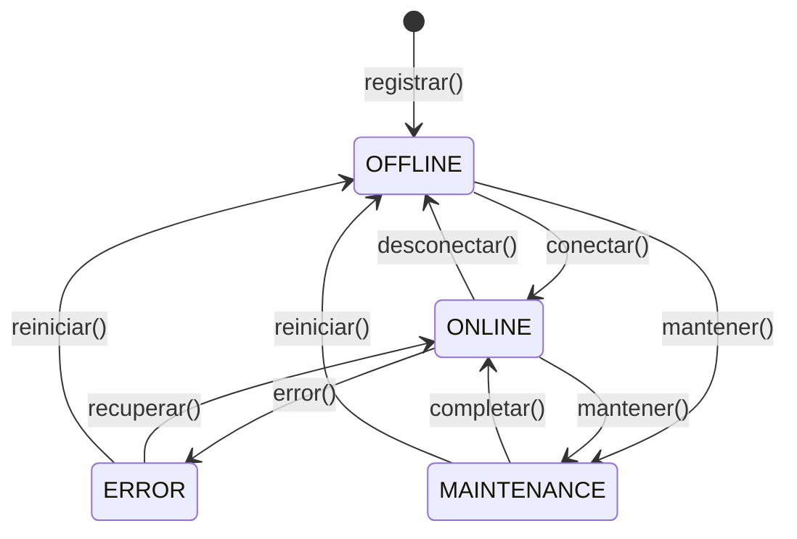
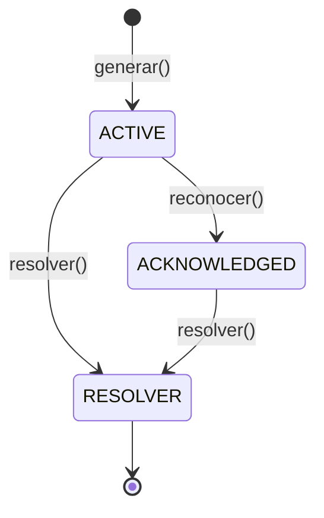

# DDD-003: Agregados y Raíces de Agregado - Mush2 LabTech

---

## Metadatos

| Campo | Valor |
|-------|-------|
| **ID** | DDD-003 |
| **Nombre** | Agregados de Mush2 LabTech |
| **Fecha** | 2026-07-14 |
| **Versión** | 1.0 |
| **Estado** | Borrador |
| **Depende de** | DDD-001, DDD-002 |

---

## 1. Resumen

Un **Agregado** es un cluster de entidades y value objects tratados como unidad para cambios de datos. La **Raíz de Agregado** es la única entrada al agregado, garantizando la consistencia transaccional y definiendo los límites de las invariantes.

Este documento detalla cada agregado identificado en Mush2 LabTech, sus entidades internas, invariantes y reglas de consistencia.

---

## 2. Princips de Diseño de Agregados

### 2.1 Reglas Fundamentales

1. **Una sola Raíz de Agregado**: Cada agregado tiene exactamente una entidad raíz
2. **Consistencia transaccional**: Todas las operaciones en un agregado se completan o fallan juntas
3. **Referencias por identidad**: Los agregados se referencian entre sí por ID, no por referencia directa
4. **Tamaño pequeño**: Los agregados deben ser lo más pequeños posibles
5. **Invariantes dentro del agregado**: Las reglas de negocio que deben cumplirse siempre van en el agregado

### 2.2 Diagrama de Agregados

```
┌─────────────────────────────────────────────────────────────────────────┐
│                         MUSH2 LABTECH                                   │
├─────────────────┬─────────────────┬─────────────────┬───────────────────┤
│                 │                 │                 │                   │
│  ┌────────────┐ │  ┌────────────┐ │  ┌────────────┐ │  ┌────────────┐  │
│  │Cultivation │ │  │   Recipe   │ │  │   Device   │ │  │    Alarm   │  │
│  │   Cycle    │ │  │    (Raíz)  │ │  │    (Raíz)  │ │  │    (Raíz)  │  │
│  │   (Raíz)   │ │  └────────────┘ │  └────────────┘ │  └────────────┘  │
│  └────────────┘ │                 │                 │                   │
│                 │                 │                 │                   │
│  ┌────────────┐ │  ┌────────────┐ │  ┌────────────┐ │  ┌────────────┐  │
│  │  Species   │ │  │    User    │ │  │   Sensor   │ │  │   Audit    │  │
│  │  Profile   │ │  │    (Raíz)  │ │  │  (Device)  │ │  │    Log     │  │
│  │   (Raíz)   │ │  └────────────┘ │  └────────────┘ │  └────────────┘  │
│  └────────────┘ │                 │                 │                   │
│                 │                 │                 │                   │
└─────────────────┴─────────────────┴─────────────────┴───────────────────┘
```

---

## 3. Agregado: CultivationCycle

### 3.1 Raíz de Agregado: `CultivationCycle`

**Contexto**: Cultivo  
**Responsabilidad**: Representar un ciclo completo de cultivo desde planificación hasta finalización

### 3.2 Estructura del Agregado

```
CultivationCycle (RAÍZ)
│
├── Propiedades de Identidad
│   ├── id: number (PK, auto-increment)
│   └── userId: UUID (propietario)
│
├── Propiedades de Estado
│   ├── status: CycleStatus { PLANNED, ACTIVE, COMPLETED, ABORTED }
│   ├── currentPhase: CultivationPhase { INCUBATION, FRUITING, MAINTENANCE, COMPLETED }
│   ├── phaseStartedAt: Date
│   ├── startDate: Date
│   └── endDate: Date
│
├── Propiedades de Configuración
│   ├── adaptationConfig: AdaptationConfig
│   │   ├── mode: { MANUAL, SEMI_AUTO, FULL_AUTO }
│   │   └── sensorBasedTrigger: boolean
│   └── notes: text
│
├── Referencias a Otros Agregados (por ID)
│   ├── deviceId: number → Device (Raíz)
│   ├── recipeId: number → Recipe (Raíz)
│   └── chamberId: number → Chamber
│
├── Datos de Dominio
│   ├── species: string (nombre de la especie)
│   └── strain: string (cepa/genética)
│
├── Entidades Internas
│   ├── PhaseTransition[] (historial de transiciones)
│   ├── CycleState[] (snapshots periódicos)
│   └── BioactiveProfile[] (análisis de compuestos)
│
└── Timestamps
    ├── createdAt: Date
    └── updatedAt: Date
```

### 3.3 Invariantes del Agregado

| ID | Invariante | Descripción | Severidad |
|----|------------|-------------|-----------|
| CC-001 | **Un ciclo activo por dispositivo** | No pueden existir dos ciclos con `status=ACTIVE` para el mismo `deviceId` | CRITICAL |
| CC-002 | **Secuencia de fases** | `currentPhase` debe seguir: INCUBATION → FRUITING → MAINTENANCE → COMPLETED | CRITICAL |
| CC-003 | **Receta obligatoria** | `recipeId` no puede ser nulo y debe referenciar una receta válida | HIGH |
| CC-004 | **Inmutabilidad post-finalización** | Un ciclo con `status=COMPLETED` o `status=ABORTED` no puede modificarse | CRITICAL |
| CC-005 | **Fase coherente con estado** | Un ciclo `PLANNED` debe estar en fase `INCUBATION` | MEDIUM |
| CC-006 | **Fechas coherentes** | `endDate` debe ser posterior a `startDate` | MEDIUM |
| CC-007 | **Transiciones válidas** | Los registros de `PhaseTransition` deben seguir la secuencia de fases | HIGH |

### 3.4 Transiciones de Estado



### 3.5 Operaciones del Agregado

| Operación | Pre-condiciones | Post-condiciones | Invariantes verificadas |
|-----------|-----------------|------------------|------------------------|
| **crearCiclo()** | Receta válida existe, dispositivo sin ciclo ACTIVE | status=PLANNED, currentPhase=INCUBATION | CC-001, CC-003 |
| **iniciarCiclo()** | status=PLANNED, sensores calibrados | status=ACTIVE, phaseStartedAt=now | CC-002 |
| **transicionarFase(toPhase)** | status=ACTIVE, fase válida según secuencia | currentPhase=toPhase, registra PhaseTransition | CC-002, CC-007 |
| **completarCiclo()** | status=ACTIVE, currentPhase=MAINTENANCE | status=COMPLETED, endDate=now | CC-004 |
| **abortarCiclo(reason)** | status=PLANNED o ACTIVE | status=ABORTED, endDate=now | CC-004 |
| **aplicarReceta(recipeId)** | status=PLANNED, receta válida | recipeId actualizado | CC-003 |
| **registrarEstado(readings)** | status=ACTIVE | Nuevo CycleState creado | — |
| **registrarBioactivo(data)** | status=ACTIVE o COMPLETED | Nuevo BioactiveProfile creado | — |

### 3.6 Reglas de Negocio del Agregado

1. **Un ciclo activo por dispositivo**: La Raíz verifica que no exista otro ciclo ACTIVE para el mismo deviceId antes de permitir `iniciarCiclo()`
2. **Secuencia obligatoria de fases**: El método `transicionarFase()` valida que la transición sea legal según la secuencia
3. **Aprobación en SEMI_AUTO**: Si `adaptationConfig.mode=SEMI_AUTO`, la transición crea un PhaseTransition con `status=PENDING`
4. **Fail-safe**: Un ciclo ACTIVE con alarma CRITICAL puede ser abortado automáticamente
5. **Registro completo**: Toda transición se registra en PhaseTransition para auditoría

---

## 4. Agregado: Recipe

### 4.1 Raíz de Agregado: `Recipe`

**Contexto**: Cultivo  
**Responsabilidad**: Definir un perfil climático reutilizable con umbrales por fase

### 4.2 Estructura del Agregado

```
Recipe (RAÍZ)
│
├── Propiedades de Identidad
│   ├── id: number (PK, auto-increment)
│   └── userId: UUID (creador)
│
├── Propiedades de Configuración
│   ├── name: string (nombre único por usuario)
│   ├── species: string (nombre de la especie)
│   └── speciesId: number (referencia a SpeciesProfile)
│
├── Value Objects Embebidos: PhaseThreshold
│   ├── IncubationThreshold (temp, hum, co2, duration)
│   ├── FruitingThreshold (temp, hum, co2, duration)
│   └── MaintenanceThreshold (temp, hum, co2)
│
├── Configuración de Ventilación
│   ├── ventilationStrategy: { TIMER, CO2_TRIGGER, HYBRID }
│   ├── faeLevel: { LOW, MEDIUM, HIGH }
│   ├── faeIntervalMinutes: number
│   └── lightCycleHours: number
│
└── Timestamps
```

### 4.3 Invariantes del Agregado

| ID | Invariante | Descripción | Severidad |
|----|------------|-------------|-----------|
| RE-001 | **Al menos una fase** | Debe tener al menos IncubationThreshold definido | HIGH |
| RE-002 | **Temperatura coherente** | tempMin < tempMax en todas las fases | MEDIUM |
| RE-003 | **Humedad coherente** | humMin < humMax en todas las fases | MEDIUM |
| RE-004 | **Nombre único por usuario** | No pueden existir dos recetas con el mismo nombre para el mismo userId | LOW |
| RE-005 | **Especie válida** | speciesId debe referenciar un SpeciesProfile existente | HIGH |
| RE-006 | **CO2 positivo** | co2Max debe ser > 0 | MEDIUM |
| RE-007 | **Duración positiva** | durationDays debe ser > 0 cuando esté definido | MEDIUM |

### 4.4 Operaciones del Agregado

| Operación | Pre-condiciones | Post-condiciones | Invariantes verificadas |
|-----------|-----------------|------------------|------------------------|
| **crearReceta(data)** | Usuario autenticado | Nueva receta creada | RE-001, RE-002, RE-003, RE-004 |
| **actualizarUmbrales(phase, thresholds)** | Receta existe | Umbrales actualizados | RE-002, RE-003 |
| **clonarReceta(newName)** | Receta original existe | Nueva receta con mismos umbrales | RE-004 |
| **eliminarReceta()** | No hay ciclos activos usando esta receta | Receta eliminada | — |

---

## 5. Agregado: SpeciesProfile

### 5.1 Raíz de Agregado: `SpeciesProfile`

**Contexto**: Cultivo  
**Responsabilidad**: Almacenar el conocimiento micológico de cada especie

### 5.2 Estructura del Agregado

```
SpeciesProfile (RAÍZ)
│
├── Propiedades de Identidad
│   ├── id: number (PK)
│   └── name: string (nombre común)
│
├── Propiedades de Clasificación
│   ├── scientificName: string (nombre binomial, único)
│   ├── adapterClass: { ADAPTOGEN, EDIBLE, MEDICINAL }
│   ├── difficultyLevel: { BEGINNER, INTERMEDIATE, ADVANCED }
│   └── originClimate: string
│
├── Propiedades de Conocimiento
│   ├── compounds: JSON (compuestos bioactivos)
│   └── description: text
│
└── Timestamps
```

### 5.3 Invariantes del Agregado

| ID | Invariante | Descripción | Severidad |
|----|------------|-------------|-----------|
| SP-001 | **Nombre científico único** | No pueden existir dos perfiles con el mismo scientificName | HIGH |
| SP-002 | **Clasificación válida** | adapterClass debe ser un valor del enum | MEDIUM |
| SP-003 | **Nivel de dificultad válido** | difficultyLevel debe ser un valor del enum | MEDIUM |

---

## 6. Agregado: Device

### 6.1 Raíz de Agregado: `Device`

**Contexto**: Hardware/Monitoreo  
**Responsabilidad**: Representar un controlador IoT y sus componentes

### 6.2 Estructura del Agregado

```
Device (RAÍZ)
│
├── Propiedades de Identidad
│   ├── id: number (PK)
│   ├── macAddress: MACAddress (único)
│   └── deviceId: string (identificador del hardware, único)
│
├── Propiedades de Hardware
│   ├── firmwareVersion: FirmwareVersion
│   ├── hwRevision: string
│   ├── ssrActiveLow: boolean
│   └── status: DeviceStatus { ONLINE, OFFLINE, MAINTENANCE, ERROR }
│
├── Propiedades de Ubicación
│   ├── userId: UUID (propietario)
│   ├── chamberId: number (referencia)
│   ├── chamberName: string
│   └── chamberLocation: string
│
├── Entidades Internas
│   ├── Sensor[] (sensores: TEMPERATURE, HUMIDITY, CO2, VOC)
│   ├── Actuator[] (actuadores: channel 0-3, state ON/OFF, mode LOCAL/REMOTE)
│   └── DeviceHealth[] (métricas de salud)
│
└── Timestamps
```

### 6.3 Invariantes del Agregado

| ID | Invariante | Descripción | Severidad |
|----|------------|-------------|-----------|
| DV-001 | **MAC única** | macAddress debe ser único en el sistema | HIGH |
| DV-002 | **DeviceId único** | deviceId debe ser único en el sistema | HIGH |
| DV-003 | **Cultivo activo bloquea eliminación** | No se puede eliminar un device con cultivo ACTIVE | HIGH |
| DV-004 | **Estado válido** | status debe ser un valor del enum | MEDIUM |
| DV-005 | **Canales válidos** | Los actuadores deben tener channel en rango 0-3 | MEDIUM |
| DV-006 | **Sensores requeridos** | Un device para cultivo debe tener sensores de temperatura y humedad | HIGH |

### 6.4 Transiciones de Estado



### 6.5 Reglas de Negocio del Agregado

1. **Conexión/desconexión**: Solo puede cambiar estado si está en el estado correcto
2. **Fail-safe**: Un device en ERROR no ejecuta comandos de control
3. **Firmware**: La actualización de firmware requiere estado MAINTENANCE
4. **Override manual**: El override de actuador dura máximo 5 minutos
5. **Sensores obligatorios**: Para cultivo activo, el device debe tener sensores de temperatura y humedad activos

---

## 7. Agregado: Alarm

### 7.1 Raíz de Agregado: `Alarm`

**Contexto**: Monitoreo  
**Responsabilidad**: Representar una notificación de condición anormal

### 7.2 Estructura del Agregado

```
Alarm (RAÍZ)
│
├── Propiedades de Identidad
│   └── id: number (PK)
│
├── Propiedades de Referencia
│   └── deviceId: number (referencia a Device)
│
├── Propiedades de Clasificación
│   ├── type: AlarmType { SENSOR_FAULT, OUT_OF_RANGE, DISCONNECTED, SYSTEM_ERROR, THRESHOLD_CROSSED }
│   ├── severity: AlarmSeverity { LOW, MEDIUM, HIGH, CRITICAL }
│   └── sensorType: SensorType { TEMPERATURE, HUMIDITY, CO2, VOC }
│
├── Propiedades de Contenido
│   ├── message: string (descripción legible)
│   ├── currentValue: number
│   ├── thresholdMin: number
│   ├── thresholdMax: number
│   └── metadata: JSON
│
├── Propiedades de Estado
│   ├── isAcknowledged: boolean
│   ├── acknowledgedBy: UUID
│   ├── acknowledgedAt: Date
│   └── resolvedAt: Date
│
└── Timestamps
```

### 7.3 Invariantes del Agregado

| ID | Invariante | Descripción | Severidad |
|----|------------|-------------|-----------|
| AL-001 | **Deduplicación** | Solo una alarma activa por (deviceId, type, sensorType) | HIGH |
| AL-002 | **Severidad calculada** | La severidad se calcula desde desviación, no se asigna manualmente | MEDIUM |
| AL-003 | **Resolución válida** | Una alarma RESOLVADA no puede modificarse | HIGH |
| AL-004 | **Aprobación CRITICAL** | Solo SUPER_ADMIN o ADMIN pueden resolver alarmes CRITICAL | HIGH |
| AL-005 | **Mensaje requerido** | message no puede ser nulo o vacío | MEDIUM |

### 7.4 Transiciones de Estado



### 7.5 Reglas de Severidad

```javascript
function calcularSeveridad(value, min, max) {
  if (value == null) return null;
  
  if (min != null && value < min) {
    const diff = min - value;
    if (diff > 3) return 'CRITICAL';
    if (diff > 1.5) return 'HIGH';
    return 'MEDIUM';
  }
  
  if (max != null && value > max) {
    const diff = value - max;
    if (diff > 3) return 'CRITICAL';
    if (diff > 1.5) return 'HIGH';
    return 'MEDIUM';
  }
  
  return null; // Dentro de rango
}
```

---

## 8. Agregado: User

### 8.1 Raíz de Agregado: `User`

**Contexto**: Usuarios  
**Responsabilidad**: Gestionar identidad, autorización y configuración de usuarios

### 8.2 Estructura del Agregado

```
User (RAÍZ)
│
├── Propiedades de Identidad
│   ├── id: UUID (PK)
│   ├── email: EmailAddress (único)
│   └── password: string (hash bcrypt)
│
├── Propiedades de Perfil
│   ├── firstName: string
│   ├── lastName: string
│   └── role: SystemRole { SUPER_ADMIN (100), ADMIN (80), OPERATOR (50), VIEWER (10) }
│
├── Propiedades de Estado
│   ├── isActive: boolean
│   └── deletedAt: Date (soft delete)
│
├── Value Objects Embebidos
│   ├── Subscription (plan, apiCallsUsed, apiCallsLimit, dataRetentionDays)
│   └── UserPreference (theme, language, telegramEnabled)
│
├── Entidades Internas
│   ├── ApiKey[] (claves de acceso con hash y permisos)
│   └── UserChamberAccess[] (permisos por cámara: OWNER, EDITOR, VIEWER)
│
└── Timestamps
```

### 8.3 Invariantes del Agregado

| ID | Invariante | Descripción | Severidad |
|----|------------|-------------|-----------|
| US-001 | **Email único** | No pueden existir dos usuarios con el mismo email | HIGH |
| US-002 | **Soft delete** | La eliminación es lógica (deletedAt), preserva integridad | HIGH |
| US-003 | **SUPER_ADMIN inmutable** | Un SUPER_ADMIN no puede ser desactivado | HIGH |
| US-004 | **Límites de API** | apiCallsUsed no puede exceder apiCallsLimit | MEDIUM |
| US-005 | **Contraseña hasheada** | password debe estar hasheada con bcrypt | HIGH |
| US-006 | **Rol válido** | role debe ser un valor del enum | MEDIUM |
| US-007 | **API Key única** | Cada API key debe ser única | HIGH |

### 8.4 Reglas de RBAC

| Acción | Rol Mínimo Requerido |
|--------|---------------------|
| Gestionar usuarios | ADMIN (80) |
| Crear/eliminar cultivos | OPERATOR (50) |
| Ver dashboards | VIEWER (10) |
| Resolver alarma CRITICAL | ADMIN (80) |
| Cambiar configuración del sistema | SUPER_ADMIN (100) |
| Gestionar suscripciones | SUPER_ADMIN (100) |

---

## 9. Matriz de Referencias entre Agregados

| Agregado Raíz | Referencia a | Tipo de Referencia | Cardinalidad |
|---------------|--------------|-------------------|--------------|
| CultivationCycle | Device | deviceId | N:1 |
| CultivationCycle | Recipe | recipeId | N:1 |
| CultivationCycle | User | userId | N:1 |
| Recipe | SpeciesProfile | speciesId | N:1 |
| Recipe | User | userId | N:1 |
| Device | User | userId | N:1 |
| Device | Chamber | chamberId | N:1 |
| Alarm | Device | deviceId | N:1 |
| Alarm | User | acknowledgedBy | N:1 |
| User | Subscription | (embebido) | 1:1 |
| User | ApiKey | (interno) | 1:N |
| User | UserChamberAccess | (interno) | 1:N |

---

## 10. Historial de Cambios

| Versión | Fecha | Autor | Cambios |
|---------|-------|-------|---------|
| 1.0 | 2026-07-14 | Equipo Mush2 | Creación del documento |

---

*Documento generado como parte del proceso de Domain-Driven Design de Mush2 LabTech.*
