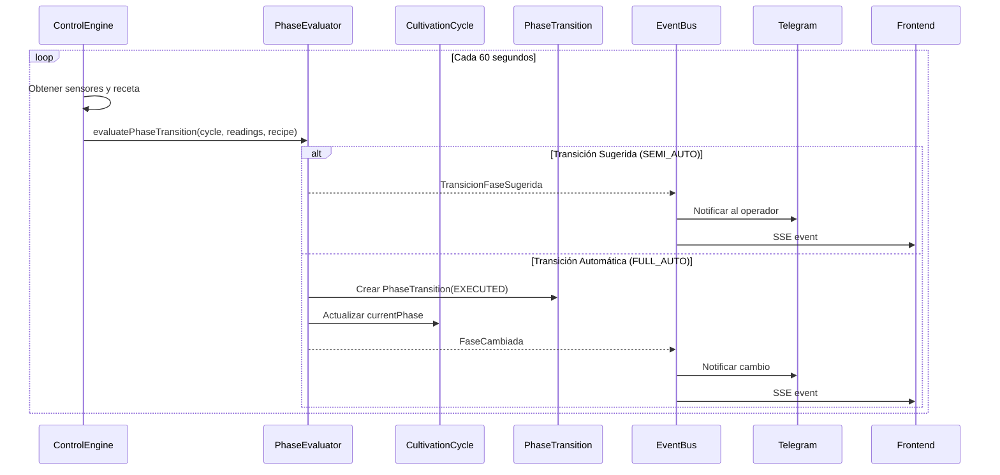
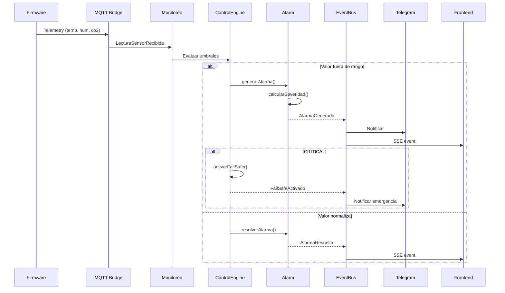
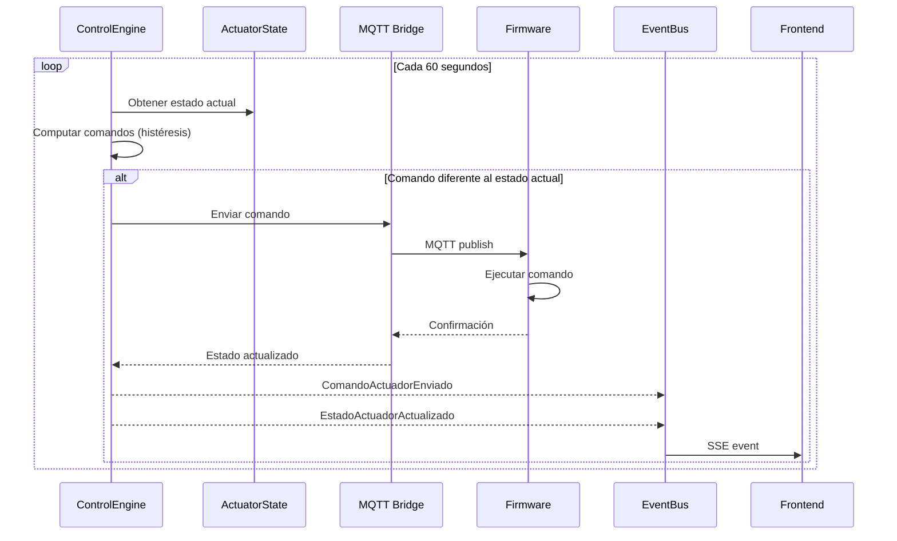

# DDD-006: Eventos de Dominio - Mush2 LabTech

---

## Metadatos

| Campo | Valor |
|-------|-------|
| **ID** | DDD-006 |
| **Nombre** | Eventos de Dominio de Mush2 LabTech |
| **Fecha** | 2026-07-14 |
| **Versión** | 1.0 |
| **Estado** | Borrador |
| **Depende de** | DDD-001, DDD-002, DDD-003 |

---

## 1. Resumen

Los **Eventos de Dominio** representan hechos significativos que ocurrieron en el sistema. Son inmutables, se publican para notificar a otros contextos y permiten la comunicación desacoplada entre componentes.

---

## 2. Propiedades Fundamentales

### 2.1 Características de un Evento de Dominio

| Propiedad | Descripción |
|-----------|-------------|
| **Inmutabilidad** | Una vez creado, no puede modificarse |
| **Hecho pasado** | Representa algo que ya sucedió |
| **Nombre en pasado** | Verbos en pasado: `CultivoIniciado`, no `IniciarCultivo` |
| **Timestamp** | Momento exacto en que ocurrió |
| **Idempotente** | Puede procesarse múltiples veces sin efecto adverso |

### 2.2 Patrón de Implementación

```javascript
// Ejemplo de Evento de Dominio
class CultivoIniciado {
  constructor({ cycleId, userId, deviceId, recipeId, species, startDate }) {
    this.eventType = 'CultivoIniciado';
    this.timestamp = new Date();
    this.data = Object.freeze({
      cycleId,
      userId,
      deviceId,
      recipeId,
      species,
      startDate
    });
  }
  
  toString() {
    return `[${this.timestamp.toISOString()}] ${this.eventType}: Cycle ${this.data.cycleId}`;
  }
}
```

---

## 3. EventBus - Sistema de Publicación

### 3.1 Implementación Actual

```javascript
// backend/src/services/eventBus.js
import { EventEmitter } from 'events';

export const events = new EventEmitter();
```

### 3.2 Eventos Soportados

| Evento | Descripción |
|--------|-------------|
| `ack` | Reconocimiento de alarma |
| `state` | Cambio de estado de actuador |
| `telemetry` | Nueva lectura de sensor |
| `alarm` | Alarma generada/resuelta |
| `control_eval` | Evaluación del motor de control |
| `phase_transition` | Transición de fase |
| `health` | Métricas de salud del dispositivo |
| `maintenance` | Evento de mantenimiento |

### 3.3 Suscriptores

```javascript
// Suscriptores del EventBus
events.on('alarm', (data) => {
  // SSE endpoint → Frontend
  // Telegram notification
});

events.on('state', (data) => {
  // SSE endpoint → Frontend
});

events.on('telemetry', (data) => {
  // SSE endpoint → Frontend
  // ThingSpeak sync
});

events.on('control_eval', (data) => {
  // SSE endpoint → Frontend
});
```

---

## 4. Eventos del Contexto Cultivo

### 4.1 CultivoCreado

| Campo | Tipo | Descripción |
|-------|------|-------------|
| `eventType` | string | 'CultivoCreado' |
| `timestamp` | Date | Momento del evento |
| `cycleId` | number | ID del ciclo creado |
| `userId` | UUID | Usuario que creó el ciclo |
| `recipeId` | number | Receta asignada |
| `species` | string | Especie del cultivo |
| `strain` | string | Cepa (opcional) |

**Disparador**: `POST /api/v1/cycles`  
**Suscriptores**: AuditLog  
**Efecto**: Registro en audit trail

### 4.2 CultivoIniciado

| Campo | Tipo | Descripción |
|-------|------|-------------|
| `eventType` | string | 'CultivoIniciado' |
| `timestamp` | Date | Momento del evento |
| `cycleId` | number | ID del ciclo |
| `deviceId` | number | Dispositivo asignado |
| `startDate` | Date | Fecha de inicio |

**Disparador**: `PATCH /api/v1/cycles/:id/start`  
**Suscriptores**: ControlEngine, Telegram, AuditLog  
**Efecto**: ControlEngine comienza a evaluar el ciclo

### 4.3 CultivoCompletado

| Campo | Tipo | Descripción |
|-------|------|-------------|
| `eventType` | string | 'CultivoCompletado' |
| `timestamp` | Date | Momento del evento |
| `cycleId` | number | ID del ciclo |
| `endDate` | Date | Fecha de finalización |
| `totalFlushes` | number | Total de flushes realizados |

**Disparador**: ControlEngine al completar fase MAINTENANCE  
**Suscriptores**: Telegram, BioactiveAnalyzer, AuditLog  
**Efecto**: Notificación y análisis de bioactivos

### 4.4 CultivoAbortado

| Campo | Tipo | Descripción |
|-------|------|-------------|
| `eventType` | string | 'CultivoAbortado' |
| `timestamp` | Date | Momento del evento |
| `cycleId` | number | ID del ciclo |
| `reason` | string | Razón de la finalización |
| `abortedBy` | UUID \| 'SYSTEM' | Quién abortó |

**Disparador**: Usuario o sistema (fail-safe)  
**Suscriptores**: Telegram, AuditLog  
**Efecto**: Notificación de aborto

### 4.5 FaseCambiada

| Campo | Tipo | Descripción |
|-------|------|-------------|
| `eventType` | string | 'FaseCambiada' |
| `timestamp` | Date | Momento del evento |
| `cycleId` | number | ID del ciclo |
| `fromPhase` | CultivationPhase | Fase anterior |
| `toPhase` | CultivationPhase | Fase nueva |
| `triggerType` | TriggerType | Tipo de trigger |
| `triggerData` | JSON | Datos del trigger |

**Disparador**: PhaseEvaluator  
**Suscriptores**: ControlEngine, Telegram, AuditLog  
**Efecto**: Actualización de parámetros de control

### 4.6 RecetaAplicada

| Campo | Tipo | Descripción |
|-------|------|-------------|
| `eventType` | string | 'RecetaAplicada' |
| `timestamp` | Date | Momento del evento |
| `cycleId` | number | ID del ciclo |
| `recipeId` | number | Nueva receta |
| `previousRecipeId` | number \| null | Receta anterior |

**Disparador**: `PATCH /api/v1/cycles/:id/recipe`  
**Suscriptores**: AuditLog  
**Efecto**: Cambio de configuración climática

### 4.7 TransicionFaseSugerida

| Campo | Tipo | Descripción |
|-------|------|-------------|
| `eventType` | string | 'TransicionFaseSugerida' |
| `timestamp` | Date | Momento del evento |
| `cycleId` | number | ID del ciclo |
| `suggestedPhase` | CultivationPhase | Fase sugerida |
| `confidence` | number | Confianza (0-1) |
| `reason` | string | Razón de la sugerencia |

**Disparador**: PhaseEvaluator en modo SEMI_AUTO  
**Suscriptores**: Telegram, Frontend (SSE)  
**Efecto**: Notificación para aprobación humana

---

## 5. Eventos del Contexto Monitoreo

### 5.1 LecturaSensorRecibida

| Campo | Tipo | Descripción |
|-------|------|-------------|
| `eventType` | string | 'LecturaSensorRecibida' |
| `timestamp` | Date | Momento del evento |
| `deviceId` | number | Dispositivo que reporta |
| `sensorType` | SensorType | Tipo de sensor |
| `value` | number | Valor medido |
| `unit` | string | Unidad de medida |

**Disparador**: MQTT message from firmware  
**Suscriptores**: ControlEngine, ThingSpeakSync, Frontend (SSE)  
**Efecto**: Evaluación de umbrales y alarmas

### 5.2 AlarmaGenerada

| Campo | Tipo | Descripción |
|-------|------|-------------|
| `eventType` | string | 'AlarmaGenerada' |
| `timestamp` | Date | Momento del evento |
| `alarmId` | number | ID de la alarma |
| `deviceId` | number | Dispositivo afectado |
| `type` | AlarmType | Tipo de alarma |
| `severity` | AlarmSeverity | Severidad |
| `sensorType` | SensorType | Sensor afectado |
| `message` | string | Descripción |
| `currentValue` | number | Valor actual |
| `thresholdMin` | number | Umbral mínimo |
| `thresholdMax` | number | Umbral máximo |

**Disparador**: ControlEngine o evaluación de umbrales  
**Suscriptores**: Telegram, Frontend (SSE), AuditLog  
**Efecto**: Notificación y posible activación de fail-safe

### 5.3 AlarmaReconocida

| Campo | Tipo | Descripción |
|-------|------|-------------|
| `eventType` | string | 'AlarmaReconocida' |
| `timestamp` | Date | Momento del evento |
| `alarmId` | number | ID de la alarma |
| `deviceId` | number | Dispositivo |
| `acknowledgedBy` | UUID | Usuario que reconoció |

**Disparador**: `PATCH /api/v1/alarms/:id/acknowledge`  
**Suscriptores**: AuditLog, Frontend (SSE)  
**Efecto**: Actualización de estado de alarma

### 5.4 AlarmaResuelta

| Campo | Tipo | Descripción |
|-------|------|-------------|
| `eventType` | string | 'AlarmaResuelta' |
| `timestamp` | Date | Momento del evento |
| `alarmId` | number | ID de la alarma |
| `deviceId` | number | Dispositivo |
| `resolvedAt` | Date | Momento de resolución |

**Disparador**: ControlEngine o `PATCH /api/v1/alarms/:id/resolve`  
**Suscriptores**: AuditLog, Frontend (SSE)  
**Efecto**: Cierre de alarma

### 5.5 SensorDesconectado

| Campo | Tipo | Descripción |
|-------|------|-------------|
| `eventType` | string | 'SensorDesconectado' |
| `timestamp` | Date | Momento del evento |
| `deviceId` | number | Dispositivo |
| `sensorType` | SensorType | Sensor desconectado |
| `lastReading` | Date | Última lectura válida |

**Disparador**: Timeout de lecturas  
**Suscriptores**: Alarm  
**Efecto**: Generación de alarma DISCONNECTED

### 5.6 DispositivoConectado

| Campo | Tipo | Descripción |
|-------|------|-------------|
| `eventType` | string | 'DispositivoConectado' |
| `timestamp` | Date | Momento del evento |
| `deviceId` | number | Dispositivo |
| `firmwareVersion` | string | Versión de firmware |

**Disparador**: MQTT connect  
**Suscriptores**: AuditLog  
**Efecto**: Actualización de lastSeen

### 5.7 DispositivoDesconectado

| Campo | Tipo | Descripción |
|-------|------|-------------|
| `eventType` | string | 'DispositivoDesconectado' |
| `timestamp` | Date | Momento del evento |
| `deviceId` | number | Dispositivo |
| `lastSeen` | Date | Última conexión |

**Disparador**: MQTT disconnect o timeout  
**Suscriptores**: Alarm, Telegram  
**Efecto**: Generación de alarma y notificación

---

## 6. Eventos del Contexto Control

### 6.1 ComandoActuadorEnviado

| Campo | Tipo | Descripción |
|-------|------|-------------|
| `eventType` | string | 'ComandoActuadorEnviado' |
| `timestamp` | Date | Momento del evento |
| `deviceId` | number | Dispositivo |
| `channel` | number | Canal (0-3) |
| `state` | ActuatorState | ON/OFF |
| `mode` | ActuatorMode | LOCAL/REMOTE |

**Disparador**: ControlEngine  
**Suscriptores**: AuditLog  
**Efecto**: Registro de comando enviado

### 6.2 EstadoActuadorActualizado

| Campo | Tipo | Descripción |
|-------|------|-------------|
| `eventType` | string | 'EstadoActuadorActualizado' |
| `timestamp` | Date | Momento del evento |
| `deviceId` | number | Dispositivo |
| `channel` | number | Canal |
| `previousState` | ActuatorState | Estado anterior |
| `newState` | ActuatorState | Estado nuevo |

**Disparador**: Firmware response  
**Suscriptores**: Frontend (SSE)  
**Efecto**: Actualización de UI

### 6.3 CicloControlEjecutado

| Campo | Tipo | Descripción |
|-------|------|-------------|
| `eventType` | string | 'CicloControlEjecutado' |
| `timestamp` | Date | Momento del evento |
| `deviceId` | number | Dispositivo evaluado |
| `readings` | JSON | Lecturas actuales |
| `commands` | JSON | Comandos generados |
| `alarms` | JSON | Alarmas generadas/resueltas |

**Disparador**: ControlEngine cada 60s  
**Suscriptores**: Frontend (SSE)  
**Efecto**: Actualización de dashboard

### 6.4 FailSafeActivado

| Campo | Tipo | Descripción |
|-------|------|-------------|
| `eventType` | string | 'FailSafeActivado' |
| `timestamp` | Date | Momento del evento |
| `deviceId` | number | Dispositivo |
| `temperature` | number | Temperatura crítica |
| `action` | string | Acción tomada |

**Disparador**: ControlEngine  
**Suscriptores**: Telegram, Alarm, AuditLog  
**Efecto**: Notificación de emergencia

### 6.5 TransicionFaseEjecutada

| Campo | Tipo | Descripción |
|-------|------|-------------|
| `eventType` | string | 'TransicionFaseEjecutada' |
| `timestamp` | Date | Momento del evento |
| `cycleId` | number | ID del ciclo |
| `fromPhase` | CultivationPhase | Fase anterior |
| `toPhase` | CultivationPhase | Fase nueva |

**Disparador**: PhaseEvaluator  
**Suscriptores**: Cultivo, Telegram  
**Efecto**: Actualización de fase

---

## 7. Eventos del Contexto Usuarios

### 7.1 UsuarioRegistrado

| Campo | Tipo | Descripción |
|-------|------|-------------|
| `eventType` | string | 'UsuarioRegistrado' |
| `timestamp` | Date | Momento del evento |
| `userId` | UUID | ID del nuevo usuario |
| `email` | string | Email registrado |
| `role` | SystemRole | Rol asignado |

**Disparador**: `POST /api/v1/auth/register`  
**Suscriptores**: AuditLog  
**Efecto**: Registro en audit trail

### 7.2 UsuarioAutenticado

| Campo | Tipo | Descripción |
|-------|------|-------------|
| `eventType` | string | 'UsuarioAutenticado' |
| `timestamp` | Date | Momento del evento |
| `userId` | UUID | ID del usuario |
| `ipAddress` | string | IP de conexión |

**Disparador**: `POST /api/v1/auth/login`  
**Suscriptores**: AuditLog  
**Efecto**: Registro de login

### 7.3 SuscripcionCambiada

| Campo | Tipo | Descripción |
|-------|------|-------------|
| `eventType` | string | 'SuscripcionCambiada' |
| `timestamp` | Date | Momento del evento |
| `userId` | UUID | ID del usuario |
| `previousPlan` | PlanType | Plan anterior |
| `newPlan` | PlanType | Plan nuevo |

**Disparador**: `PATCH /api/v1/subscriptions/:id`  
**Suscriptores**: Telegram, AuditLog  
**Efecto**: Notificación de cambio

### 7.4 ApiKeyCreada

| Campo | Tipo | Descripción |
|-------|------|-------------|
| `eventType` | string | 'ApiKeyCreada' |
| `timestamp` | Date | Momento del evento |
| `userId` | UUID | ID del usuario |
| `apiKeyId` | number | ID de la API key |
| `permissions` | string[] | Permisos asignados |

**Disparador**: `POST /api/v1/api-keys`  
**Suscriptores**: AuditLog  
**Efecto**: Registro de creación

### 7.5 ApiKeyRotada

| Campo | Tipo | Descripción |
|-------|------|-------------|
| `eventType` | string | 'ApiKeyRotada' |
| `timestamp` | Date | Momento del evento |
| `userId` | UUID | ID del usuario |
| `apiKeyId` | number | ID de la API key |
| `previousKeyId` | number | ID de la key anterior |

**Disparador**: `POST /api/v1/api-keys/:id/rotate`  
**Suscriptores**: AuditLog  
**Efecto**: Invalidación de key anterior

---

## 8. Flujos de Eventos

### 8.1 Flujo: Transición Automática de Fase



### 8.2 Flujo: Generación de Alarma



### 8.3 Flujo: Control de Actuadores



---

## 9. Eventos y SSE (Server-Sent Events)

### 9.1 Endpoint SSE

```
GET /events
```

### 9.2 Eventos enviados al Frontend

| Evento SSE | Datos | Frecuencia |
|------------|-------|------------|
| `ack` | Alarm acknowledgment | Bajo demanda |
| `state` | Actuator state change | En tiempo real |
| `telemetry` | Sensor readings | Cada lectura |
| `alarm` | Alarm generated/resolved | En evento |
| `control_eval` | Control cycle evaluation | Cada 60s |

### 9.3 Implementación

```javascript
// backend/src/app.js
app.get('/events', (req, res) => {
  res.writeHead(200, {
    'Content-Type': 'text/event-stream',
    'Cache-Control': 'no-cache',
    'Connection': 'keep-alive'
  });
  
  const sendEvent = (eventType, data) => {
    res.write(`event: ${eventType}\n`);
    res.write(`data: ${JSON.stringify(data)}\n\n`);
  };
  
  events.on('ack', (data) => sendEvent('ack', data));
  events.on('state', (data) => sendEvent('state', data));
  events.on('telemetry', (data) => sendEvent('telemetry', data));
  events.on('alarm', (data) => sendEvent('alarm', data));
  events.on('control_eval', (data) => sendEvent('control_eval', data));
  
  req.on('close', () => {
    events.removeListener('ack', sendEvent);
    // ... cleanup listeners
  });
});
```

---

## 10. Matriz de Eventos por Contexto

| Contexto | Eventos | Suscriptores Principales |
|----------|---------|-------------------------|
| **Cultivo** | CultivoCreado, CultivoIniciado, CultivoCompletado, CultivoAbortado, FaseCambiada, RecetaAplicada, TransicionFaseSugerida | ControlEngine, Telegram, AuditLog |
| **Monitoreo** | LecturaSensorRecibida, AlarmaGenerada, AlarmaReconocida, AlarmaResuelta, SensorDesconectado, DispositivoConectado, DispositivoDesconectado | ControlEngine, Telegram, Frontend |
| **Control** | ComandoActuadorEnviado, EstadoActuadorActualizado, CicloControlEjecutado, FailSafeActivado, TransicionFaseEjecutada | AuditLog, Frontend, Telegram |
| **Usuarios** | UsuarioRegistrado, UsuarioAutenticado, SuscripcionCambiada, ApiKeyCreada, ApiKeyRotada | AuditLog, Telegram |

---

## 11. Historial de Cambios

| Versión | Fecha | Autor | Cambios |
|---------|-------|-------|---------|
| 1.0 | 2026-07-14 | Equipo Mush2 | Creación del documento |

---

*Documento generado como parte del proceso de Domain-Driven Design de Mush2 LabTech.*
