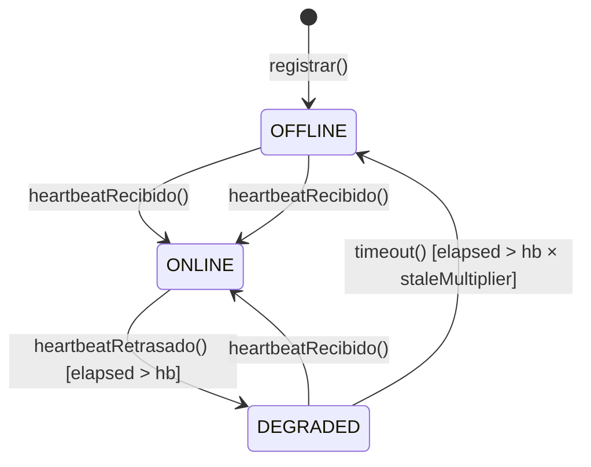
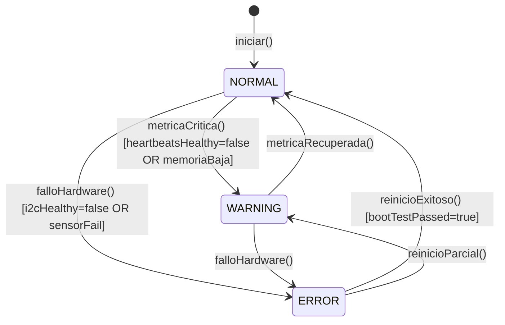
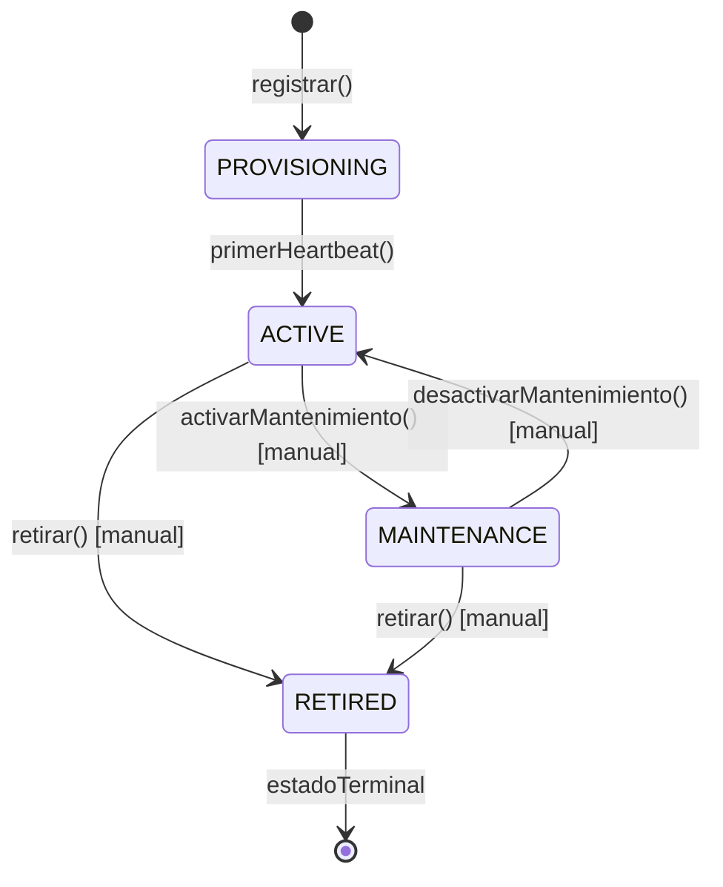

# DDD-008: Device Status Policy

---

## Metadatos

| Campo | Valor |
|-------|-------|
| **ID** | DDD-008 |
| **Nombre** | Device Status Policy |
| **Fecha** | 2026-07-25 |
| **Versión** | 1.0 |
| **Estado** | Aceptado |
| **Autor** | Equipo Mush2 |
| **Depende de** | DDD-001, DDD-003, DDD-005, DDD-006 |
| **Aprobado por** | ADR-025 (Device Status Policy) |

---

## 1. Resumen

> Este documento define la **Device Status Policy**: la política única que gobierna cómo se determina, interpreta y representa el estado de un dispositivo en todo el sistema.
>
> Establece el lenguaje ubicuo, clasifica los estados existentes, identifica inconsistencias entre capas y propone un modelo definitivo con reglas de negocio, precedencia de fuentes y responsabilidades por capa.
>
> Este documento reemplaza la Sección 5 de DDD-005 (Device - Estado del Dispositivo) y actualiza la definición de `DeviceStatus` en DDD-003.

---

## 2. Causa Raíz

> El sistema dispone de múltiples fuentes de información sobre la condición del dispositivo (FSM del firmware, métricas de salud y conectividad), pero no existe una política que defina cómo combinar estas señales para determinar el estado de dominio.

---

## 3. Inventario de Estados Existentes

### 3.1 Firmware — DeviceState (FSM interna)

El firmware ESP32-S3 implementa una máquina de estados finitos con 10 estados:

| Estado | Valor | Tipo | Significado |
|--------|-------|------|-------------|
| `ST_BOOT` | 0 | Transitorio | Arranque del MCU, antes de inicializar |
| `ST_INIT` | 1 | Transitorio | Inicialización de periféricos |
| `ST_WIFI` | 2 | Transitorio | Conectando a WiFi |
| `ST_NORMAL` | 3 | Operativo | Funcionamiento normal, todos los subsistemas OK |
| `ST_DEGRADED` | 4 | Operativo | WiFi degradado (conectado pero señal débil) |
| `ST_ERROR` | 5 | Operativo | Fallo de sensor I2C o sobreheat (temp ≥ 32°C) |
| `ST_RECOVERY` | 6 | Transitorio | Recuperándose de estado de error |
| `ST_SAFE` | 7 | Transitorio | Modo seguro (boot test falló, 5+ reboots anormales) |
| `ST_OTA_UPDATING` | 8 | Transitorio | Actualización OTA en curso |
| `ST_PROVISIONING` | 9 | Transitorio | Configuración BLE en curso |

**Transiciones principales:**

```
BOOT → INIT → WIFI → NORMAL ←→ DEGRADED
                              ↓
                            ERROR ←→ RECOVERY
                              ↓
NORMAL/DEGRADED → OTA_UPDATING → NORMAL | ERROR
INIT → SAFE → INIT
INIT → PROVISIONING → WIFI
```

**Publicación MQTT:** El firmware publica el estado FSM como campo `"mode"` en el tópico `status`. El campo `"state"` solo toma valores `"online"` o `"offline"` (LWT).

**Fuente:** `firmware/src/state_machine.h`, `firmware/src/mqtt_client.cpp`

### 3.2 Firmware — Health Metrics (payload de salud)

El firmware publica métricas detalladas en el tópico `health`:

| Campo | Tipo | Descripción |
|-------|------|-------------|
| `heartbeatsHealthy` | bool | `false` si algún task no reporta heartbeat en 30s |
| `staleTaskMask` | uint8 | Bitmask de tasks que no reportan heartbeat |
| `i2cHealthy` | bool | Bus I2C operativo |
| `sensorAht21` | bool | Sensor de temperatura/humedad detectado |
| `sensorEns160` | bool | Sensor de CO2/VOC detectado |
| `bootTestPassed` | bool | Test de arranque completado |
| `freeHeap` | uint32 | Memoria heap disponible |
| `rebootCount` | uint8 | Contador de reinicios anormales |
| `uptime` | uint32 | Tiempo encendido (segundos) |

**Fuente:** `firmware/src/mqtt_client.cpp:87-119`, `firmware/src/health_monitor.h`

### 3.3 Backend — HEALTH_STATES (cómputo)

El backend computa 7 estados basándose exclusivamente en timing de `lastSeen`:

| Estado | Criterio | Default |
|--------|----------|---------|
| `PROVISIONING` | `lastSeen` es null o 0 | — |
| `ONLINE` | `elapsed ≤ heartbeatInterval` | 10s |
| `DEGRADED` | `elapsed ≤ heartbeatInterval × staleMultiplier` | 10×3 = 30s |
| `STALE` | `elapsed ≤ heartbeatInterval × offlineMultiplier` | 10×6 = 60s |
| `OFFLINE` | `elapsed > heartbeatInterval × offlineMultiplier` | >60s |
| `MAINTENANCE` | `device.maintenanceMode = true` | manual |
| `RETIRED` | `device.status = 'RETIRED'` | manual |

El DB ENUM también incluye `ERROR` pero nunca se computa.

**Observación crítica:** El backend **ignora** las health metrics del firmware (`heartbeatsHealthy`, `staleTaskMask`, `i2cHealthy`, etc.) para el cómputo de estado. Solo usa el timing de `lastSeen`.

**Fuente:** `backend/src/services/deviceHealthService.js:7-33`

### 3.4 Frontend — Representaciones visuales

El frontend define el estado de dispositivos en **5 ubicaciones** con definiciones inconsistentes:

| Ubicación | Estados soportados | Problema |
|-----------|-------------------|----------|
| `shared/constants/status.js` | 4 (ONLINE, OFFLINE, MAINTENANCE, ERROR) | Incompleto — falta DEGRADED, STALE, PROVISIONING, RETIRED |
| `DashboardPage.jsx` STATUS_DOT_COLORS | 7, pero solo 2 salidas visuales | Solo ONLINE es verde, todo lo demás es gris |
| `DeviceListPage.jsx` STATUS_COLORS | 8 con colores diferenciados | No usa StatusBadge, definición inline |
| `DeviceConnectivityPanel.jsx` STATUS_CONFIG | 7 con iconos y labels | No exportado, no compartido |
| `StatusBadge.jsx` + CSS | 6 clases CSS teóricas | CSS solo define 3 (.online, .offline, .error) |

**Resultado:** Un dispositivo en estado `DEGRADED` se ve idéntico a uno `OFFLINE` en el Dashboard, pero diferente en la lista de dispositivos.

**Fuente:** Múltiples archivos en `frontend/src/`

---

## 4. Clasificación de Estados

### 4.1 Por naturaleza

| Estado | Naturaleza | Justificación |
|--------|-----------|---------------|
| `ST_BOOT` | Transitorio (firmware) | Fase de arranque, nunca persiste |
| `ST_INIT` | Transitorio (firmware) | Inicialización, nunca persiste |
| `ST_WIFI` | Transitorio (firmware) | Conectividad WiFi en progreso |
| `ST_NORMAL` | Operativo (firmware) | Funcionamiento correcto |
| `ST_DEGRADED` | Operativo (firmware) | WiFi con problemas pero conectado |
| `ST_ERROR` | Operativo (firmware) | Fallo de hardware detectado |
| `ST_RECOVERY` | Transitorio (firmware) | Recuperándose de error |
| `ST_SAFE` | Transitorio (firmware) | Modo seguro, boot test falló |
| `ST_OTA_UPDATING` | Transitorio (firmware) | OTA en progreso |
| `ST_PROVISIONING` | Transitorio (firmware) | BLE provisioning activo |
| `PROVISIONING` | Lifecycle (backend) | Dispositivo registrado pero nunca ha comunicado |
| `ONLINE` | Connectivity (backend) | Última comunicación dentro del heartbeat |
| `DEGRADED` | Connectivity (backend) | Última comunicación entre 1× y 3× heartbeat |
| `STALE` | Connectivity (backend) | Última comunicación entre 3× y 6× heartbeat |
| `OFFLINE` | Connectivity (backend) | Última comunicación fuera de umbral |
| `MAINTENANCE` | Lifecycle (backend) | Mantenimiento manual activo |
| `RETIRED` | Lifecycle (backend) | Dispositivo retirado permanentemente |
| `ERROR` | No computado (backend) | Existe en DB ENUM, nunca se asigna |

### 4.2 Por capa de origen

| Capa | Define | Determina | Expone |
|------|--------|-----------|--------|
| **Firmware** | FSM + health metrics | Estado interno + salud de subsistemas | `"state"`, `"mode"`, health payload |
| **Backend** | HEALTH_STATES | Estado de dominio computado | `status` en API REST + SSE |
| **Frontend** | STATUS_COLORS, etc. | Representación visual | Badges, dots, cards |

### 4.3 Conceptos de negocio vs artefactos de implementación

| Concepto de negocio | Estados que lo representan |
|---------------------|---------------------------|
| **Conectividad** | ¿El dispositivo es alcanzable por la red? |
| **Salud operativa** | ¿El dispositivo funciona correctamente a nivel de hardware? |
| **Ciclo de vida** | ¿En qué fase de gestión está el dispositivo? |

| Artefacto de implementación | Problema |
|-----------------------------|----------|
| `STALE` | Indicador de timing, no un estado de negocio. Creado por el backend como zona intermedia entre DEGRADED y OFFLINE |
| `DEGRADED` | Significado ambiguo: WiFi degradado en firmware vs "sin datos hace 10-30s" en backend |
| `ERROR` | Existe en DB ENUM pero nunca se computa. En firmware tiene significado específico que no se expone |

---

## 5. Detección de Duplicidades, Ambigüedades y Dependencias

### 5.1 Duplicidades

| Duplicidad | Capas afectadas | Impacto |
|------------|----------------|---------|
| Definición de estados en 5 archivos frontend | Frontend | Inconsistencia visual entre vistas |
| `status` como ENUM plano en DB + valor computado en API | Backend-Frontend | Confusión sobre fuente de verdad |
| `device_status_changed` SSE registrado pero no consumido | Backend-Frontend | Sin actualización en tiempo real |
| DDD-005 define 4 estados, sistema real tiene 7+ | Documentación-Código | Documentación obsoleta |
| DDD-003 define `DeviceStatus { ONLINE, OFFLINE, MAINTENANCE, ERROR }` | Documentación-Código | Modelo incompleto |

### 5.2 Ambigüedades

| Ambigüedad | Pregunta sin respuesta |
|------------|----------------------|
| `DEGRADED` dual | ¿Significa WiFi degradado (firmware) o latencia elevada (backend)? |
| `STALE` sin equivalente | ¿Es un estado o un indicador? ¿Debe exponerse al usuario? |
| `ERROR` sin cómputo | ¿Cuándo se asigna? ¿Quién lo determina? |
| Precedencia de fuentes | Si firmware dice `ST_ERROR` pero `lastSeen` es de hace 3s, ¿qué estado tiene? |
| Health metrics ignoradas | ¿Por qué el backend no usa `heartbeatsHealthy`, `i2cHealthy`, etc.? |

### 5.3 Dependencias

| Dependencia | Descripción |
|-------------|-------------|
| Firmware → Backend | El firmware expone FSM state y health metrics via MQTT. El backend los almacena pero solo usa `lastSeen` |
| Backend → Frontend | El backend computa `status` y lo envía via REST/SSE. El frontend lo consume |
| DDD-005 → Device state machine | DDD-005 Sección 5 define el modelo que debe actualizarse |
| DDD-003 → Device aggregate | DDD-003 define `DeviceStatus` que debe reemplazarse |
| ADR-009 → Control Engine | El control engine depende del estado del dispositivo para operar |

---

## 6. Criterio de Precedencia entre Fuentes

### 6.1 El problema

El firmware reporta tres tipos de información sobre el dispositivo:

1. **Estado FSM** (`"mode"` en topic `status`): `ST_NORMAL`, `ST_ERROR`, etc.
2. **Health metrics** (topic `health`): `heartbeatsHealthy`, `i2cHealthy`, etc.
3. **Presencia** (last `lastSeen` en backend): timing de última comunicación

Cuando estas fuentes se contradicen, el sistema debe determinar un estado único.

### 6.2 Escenarios de contradicción

| Escenario | FSM | Health | LastSeen | Pregunta |
|-----------|-----|--------|----------|----------|
| A | `ST_ERROR` | `i2cHealthy: false` | hace 3s | ¿ONLINE con error, ERROR, o DEGRADED? |
| B | `ST_NORMAL` | — | hace 5min | ¿OFFLINE o NORMAL? |
| C | `ST_NORMAL` | `heartbeatsHealthy: false` | hace 15s | ¿DEGRADED o NORMAL? |
| D | `ST_SAFE` | `bootTestPassed: false` | hace 10min | ¿OFFLINE o PROVISIONING? |
| E | `ST_OTA_UPDATING` | — | hace 2min | ¿OFFLINE o OTA_UPDATING? |

### 6.3 Reglas de precedencia (propuesta para definir en modelo)

La política debe definir:

1. **Qué fuentes se combinan** para determinar el estado de dominio
2. **Qué precedencia tiene cada fuente** ante contradicciones
3. **Cómo se traduce** la FSM del firmware al modelo de dominio
4. **Cuándo las health metrics** modulan el estado determinado por timing

---

## 7. Modelo Propuesto

### 7.1 Enfoque: Modelo multidimensional compuesto

El modelo propone que el "estado de dominio" no es un valor plano sino una **composición de dimensiones**, cada una con su propio ciclo de vida y criterios de determinación.

**Dimensiones identificadas:**

| Dimensión | Pregunta que responde | Valores posibles |
|-----------|----------------------|------------------|
| **Conectividad** | ¿El dispositivo es alcanzable? | `ONLINE`, `DEGRADED`, `OFFLINE` |
| **Salud** | ¿El hardware funciona correctamente? | `NORMAL`, `WARNING`, `ERROR` |
| **Ciclo de vida** | ¿En qué fase de gestión está? | `PROVISIONING`, `ACTIVE`, `MAINTENANCE`, `RETIRED` |

### 7.2 Serialización

El estado compuesto se serializa como un objeto:

```json
{
  "connectivity": "ONLINE",
  "health": "NORMAL",
  "lifecycle": "ACTIVE",
  "lastSeen": "2026-07-25T15:00:00Z",
  "diagnostics": {
    "i2c": "OK",
    "sensorAht21": "OK",
    "sensorEns160": "OK",
    "heartbeatsHealthy": true
  }
}
```

### 7.3 Determinación por dimensión

**Conectividad** — Determinada por timing de `lastSeen`:

| Valor | Criterio |
|-------|----------|
| `ONLINE` | `elapsed ≤ heartbeatInterval` |
| `DEGRADED` | `elapsed ≤ heartbeatInterval × staleMultiplier` |
| `OFFLINE` | `elapsed > heartbeatInterval × staleMultiplier` |

**Salud** — Determinada por health metrics del firmware:

| Valor | Criterio |
|-------|----------|
| `NORMAL` | `heartbeatsHealthy = true` AND `i2cHealthy = true` AND `bootTestPassed = true` |
| `WARNING` | Cualquier condición de advertencia (stale tasks, memoria baja, etc.) |
| `ERROR` | `heartbeatsHealthy = false` OR `i2cHealthy = false` OR `bootTestPassed = false` |

**Ciclo de vida** — Determinada por estado administrativo:

| Valor | Criterio |
|-------|----------|
| `PROVISIONING` | `lastSeen = null` (nunca ha comunicado) |
| `ACTIVE` | Valor por defecto cuando el dispositivo está registrado |
| `MAINTENANCE` | `device.maintenanceMode = true` |
| `RETIRED` | `device.status = 'RETIRED'` |

### 7.4 Máquina de estados por dimensión

#### 7.4.1 Conectividad



#### 7.4.2 Salud



#### 7.4.3 Ciclo de vida



### 7.5 Determinación del estado compuesto

El estado de dominio se computa como la **intersección** de las tres dimensiones:

```
estadoDominio = {
  connectivity: computeConnectivity(lastSeen, heartbeatInterval, staleMultiplier),
  health: computeHealth(healthMetrics),
  lifecycle: computeLifecycle(device)
}
```

La precedencia en caso de contradicción:

1. **Ciclo de vida tiene máxima precedencia**: Si el dispositivo está en `MAINTENANCE` o `RETIRED`, las otras dimensiones se ignoran para efectos de UI
2. **Conectividad precede a Salud**: Si el dispositivo está `OFFLINE`, su salud no se evalúa (no hay datos frescos)
3. **Salud modula Conectividad**: Un dispositivo puede estar `ONLINE` pero con `health: ERROR` si sus métricas internas reportan fallo

### 7.6 Escenarios resueltos

| Escenario | Connectivity | Health | Lifecycle | Estado compuesto |
|-----------|-------------|--------|-----------|-----------------|
| A: `ST_ERROR`, `i2cHealthy: false`, lastSeen 3s | ONLINE | ERROR | ACTIVE | ONLINE/ERROR/ACTIVE |
| B: `ST_NORMAL`, lastSeen 5min | OFFLINE | — | ACTIVE | OFFLINE/—/ACTIVE |
| C: `ST_NORMAL`, `heartbeatsHealthy: false`, lastSeen 15s | DEGRADED | WARNING | ACTIVE | DEGRADED/WARNING/ACTIVE |
| D: `ST_SAFE`, `bootTestPassed: false`, lastSeen 10min | OFFLINE | ERROR | ACTIVE | OFFLINE/ERROR/ACTIVE |
| E: `ST_OTA_UPDATING`, lastSeen 2min | DEGRADED | — | ACTIVE | DEGRADED/—/ACTIVE |

---

## 8. Lenguaje Ubicuo

| Término | Definición |
|---------|------------|
| **Conectividad** | Capacidad del dispositivo de mantener comunicación con el backend a través de heartbeat MQTT |
| **Salud** | Condición operativa del hardware del dispositivo, determinada por métricas internas reportadas por firmware |
| **Ciclo de vida** | Fase administrativa del dispositivo en el sistema |
| **Heartbeat** | Señal periódica que el firmware publica para indicar que está operativo |
| **LastSeen** | Timestamp de la última comunicación recibida del dispositivo (cualquier tipo: telemetry, health, status, ack) |
| **Health metrics** | Métricas de diagnóstico del firmware: estado de I2C, sensores, memoria, heartbeat de tasks |
| **FSM state** | Estado de la máquina de estados finitos interna del firmware |
| **Estado de dominio** | Composición de las tres dimensiones (Connectivity, Health, Lifecycle) que representa la condición completa del dispositivo |

---

## 9. Reglas de Negocio

| ID | Regla | Severidad |
|----|-------|-----------|
| RULE-001 | El estado de dominio es la composición de tres dimensiones: Connectivity, Health, Lifecycle | HIGH |
| RULE-002 | Connectivity se determina exclusivamente por el timing de `lastSeen` vs umbrales configurables | HIGH |
| RULE-003 | Health se determina exclusivamente por las health metrics reportadas por el firmware | HIGH |
| RULE-004 | Lifecycle se determina por el estado administrativo del dispositivo (maintenanceMode, retired) | HIGH |
| RULE-005 | Si `lastSeen` es null, Lifecycle = PROVISIONING independientemente de otras dimensiones | HIGH |
| RULE-006 | Un dispositivo en MAINTENANCE puede seguir reportando health metrics pero su estado UI es MAINTENANCE | MEDIUM |
| RULE-007 | Un dispositivo RETIRED no recibe comandos ni genera alarmas | HIGH |
| RULE-008 | Los umbrales de conectividad (heartbeatInterval, staleMultiplier) son configurables por dispositivo | MEDIUM |
| RULE-009 | El frontend debe representar las tres dimensiones cuando sea relevante para la vista | MEDIUM |
| RULE-010 | La FSM del firmware NO se expone directamente al dominio; se traduce a través de health metrics | HIGH |

---

## 10. Representación Conceptual

### 10.1 Para el usuario

El usuario ve una **representación compuesta** del estado:

- **Badge principal**: Muestra el estado de mayor precedencia (Lifecycle si es MAINTENANCE/RETIRED, Connectivity si es OFFLINE, Health si es ERROR)
- **Indicadores secundarios**: Muestran las otras dimensiones cuando son relevantes
- **Tooltip/detalle**: Muestra la composición completa

### 10.2 Para el sistema

El sistema almacena y transmite la **composición completa**:

```json
{
  "status": {
    "connectivity": "ONLINE",
    "health": "NORMAL",
    "lifecycle": "ACTIVE"
  }
}
```

---

## 11. Ejemplos

### Ejemplo 1: Dispositivo funcionando correctamente

```json
{
  "connectivity": "ONLINE",
  "health": "NORMAL",
  "lifecycle": "ACTIVE",
  "lastSeen": "2026-07-25T15:00:00Z",
  "diagnostics": {
    "i2c": "OK",
    "sensorAht21": "OK",
    "sensorEns160": "OK",
    "heartbeatsHealthy": true
  }
}
```

**UI:** Badge verde "En línea", sin indicadores de advertencia.

### Ejemplo 2: Dispositivo con sensor I2C fallido

```json
{
  "connectivity": "ONLINE",
  "health": "ERROR",
  "lifecycle": "ACTIVE",
  "lastSeen": "2026-07-25T15:00:00Z",
  "diagnostics": {
    "i2c": "FAIL",
    "sensorAht21": "OK",
    "sensorEns160": "FAIL",
    "heartbeatsHealthy": true
  }
}
```

**UI:** Badge rojo "Error", sub-label "Sensor I2C fallido".

### Ejemplo 3: Dispositivo en mantenimiento

```json
{
  "connectivity": "ONLINE",
  "health": "NORMAL",
  "lifecycle": "MAINTENANCE",
  "lastSeen": "2026-07-25T15:00:00Z"
}
```

**UI:** Badge azul "Mantenimiento", sin indicadores de error.

### Ejemplo 4: Dispositivo sin conexión

```json
{
  "connectivity": "OFFLINE",
  "health": null,
  "lifecycle": "ACTIVE",
  "lastSeen": "2026-07-25T14:50:00Z"
}
```

**UI:** Badge gris "Fuera de línea", health no determinable (sin datos frescos).

---

## 12. Tabla de Referencias

| Elemento | Descripción | Referencia |
|----------|-------------|------------|
| Device aggregate | Agregado que contiene el estado | DDD-003 §6 |
| Device state machine | Máquina de estados previa (obsoleta) | DDD-005 §5 |
| Domain events | Eventos de transición de estado | DDD-006 |
| Control engine | Consumidor del estado del dispositivo | ADR-009, ADR-021 |
| Fail-Safe overheat | Transiciones de estado por emergencia | ADR-010 |
| Event bus | Transporte de eventos de estado | ADR-017 |

---

## 13. Diagrama de Dependencias

```
┌──────────────────────────────────────────────────────┐
│                    FIRMWARE                           │
│  ┌─────────────┐  ┌──────────────┐                   │
│  │ DeviceState │  │ HealthMonitor│                   │
│  │ (FSM 10 est)│  │ (metrics)    │                   │
│  └──────┬──────┘  └──────┬───────┘                   │
│         │                │                           │
│         └───────┬────────┘                           │
│                 │ MQTT: status + health               │
└─────────────────┼────────────────────────────────────┘
                  │
                  ▼
┌──────────────────────────────────────────────────────┐
│                    BACKEND                            │
│  ┌───────────────────────┐                           │
│  │ deviceHealthService   │                           │
│  │ computeStatus()       │  ← Solo usa lastSeen      │
│  │ (ignora health metrics)│                          │
│  └───────────┬───────────┘                           │
│              │                                       │
│  ┌───────────▼───────────┐                           │
│  │ API REST + SSE        │                           │
│  │ { status: "ONLINE" }  │  ← ENUM plano            │
│  └───────────┬───────────┘                           │
└──────────────┼───────────────────────────────────────┘
               │
               ▼
┌──────────────────────────────────────────────────────┐
│                   FRONTEND                            │
│  ┌─────────────┐ ┌──────────────┐ ┌───────────────┐ │
│  │ Dashboard   │ │ DeviceList   │ │ Connectivity  │ │
│  │ STATUS_DOT  │ │ STATUS_COLORS│ │ STATUS_CONFIG │ │
│  │ (2 colores) │ │ (8 colores)  │ │ (7 configs)   │ │
│  └─────────────┘ └──────────────┘ └───────────────┘ │
│  ↑ 5 definiciones duplicadas e inconsistentes        │
└──────────────────────────────────────────────────────┘
```

---

## 14. Documentos Relacionados

| Documento | Relación | Acción requerida |
|-----------|----------|------------------|
| DDD-003 §6 | Define `DeviceStatus { ONLINE, OFFLINE, MAINTENANCE, ERROR }` | Actualizar con nuevo modelo |
| DDD-005 §5 | Define Device state machine con 4 estados | Reemplazar con DDD-008 |
| DDD-006 | Domain events de transición | Actualizar eventos según nuevo modelo |
| ADR-025 | Decisión arquitectónica | Crear como companion de DDD-008 |

---

## 15. Historial de Cambios

| Versión | Fecha | Autor | Cambios |
|---------|-------|-------|---------|
| 1.0 | 2026-07-25 | Equipo Mush2 | Creación del documento |
| 1.1 | 2026-08-01 | Equipo Mush2 | Promovido a **Aceptado** |

---

*Documento generado como parte del proceso de Domain-Driven Design de Mush2.*
