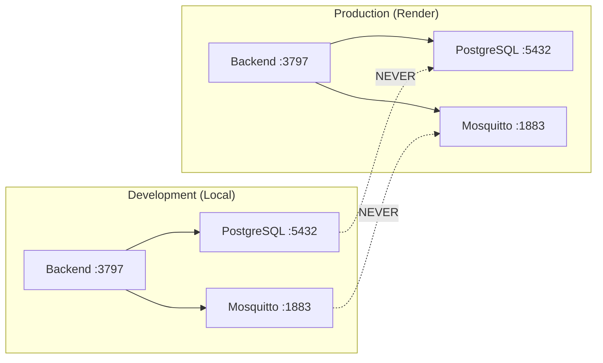

# DDD-009 — Configuration & Environment Model

---

## Metadatos

| Campo | Valor |
|-------|-------|
| **ID** | DDD-009 |
| **Nombre** | Configuration & Environment Model |
| **Fecha** | 2026-07-27 |
| **Versión** | 1.0 |
| **Estado** | Aceptado |
| **Autor** | AlejandroMaturana |
| **Depende de** | DDD-002 (Bounded Contexts) |

---

## 1. Resumen

> Este documento define el modelo de dominio para la configuración y el aislamiento de ambientes en Mush2. Establece qué es un Environment, cómo se estructura la configuración por ambiente y qué garantías ofrece el sistema para prevenir interferencias entre entornos.

---

## 2. Bounded Context: Infrastructure & Configuration

### 2.1 Definición de Environment

Un **Environment** es una instancia aislada del sistema Mush2 que contiene todos los recursos necesarios para su operación independiente.

```
Environment
├── identity: EnvironmentId (development | laboratory | testing | staging | production)
├── configuration: ConfigurationSet
├── infrastructure: InfrastructureSet
└── validation: ValidationRules
```

### 2.2 Environment Identity

| Environment | Propósito | Infraestructura |
|-------------|-----------|-----------------|
| `development` | Desarrollo local del equipo | Docker Desktop (local) |
| `laboratory` | Pruebas en hardware real | Servidor local o VPS dedicado |
| `testing` | QA automatizado | CI/CD o VPS |
| `staging` | Pre-producción | Réplica de producción |
| `production` | Servicio activo al cliente | Render / VPS / Cloud |

### 2.3 ConfigurationSet

Cada ambiente posee un conjunto de configuración completamente independiente:

```typescript
interface ConfigurationSet {
  backend: BackendConfig;
  database: DatabaseConfig;
  mqtt: MQTTConfig;
  security: SecurityConfig;
  logging: LoggingConfig;
}

interface BackendConfig {
  port: number;
  corsOrigin: string;
  rateLimit: RateLimitConfig;
}

interface DatabaseConfig {
  url: string;
  host: string;
  port: number;
  database: string;
  username: string;
  password: string;
}

interface MQTTConfig {
  brokerUrl: string;
  username: string;
  password: string;
}

interface SecurityConfig {
  jwtSecret: string;
  encryptionKey: string;
}

interface LoggingConfig {
  level: string;
  timezone: string;
}
```

### 2.4 InfrastructureSet

Cada ambiente tiene infraestructura dedicada:

```typescript
interface InfrastructureSet {
  postgres: PostgresInstance;
  mosquitto: MosquittoInstance;
  volumes: VolumeSet;
  networks: NetworkSet;
}

interface PostgresInstance {
  containerName: string;
  database: string;
  username: string;
  port: number;  // Host-mapped port (cada环境 usa uno diferente)
}

interface MosquittoInstance {
  containerName: string;
  port: number;  // Host-mapped port
}
```

### 2.5 Reglas de Aislamiento

| ID | Regla | Severidad |
|----|-------|-----------|
| ENV-001 | Ningún ambiente puede compartir una instancia de PostgreSQL con otro | CRITICAL |
| ENV-002 | Ningún ambiente puede compartir un broker MQTT con otro | CRITICAL |
| ENV-003 | Las variables de entorno deben expresar explícitamente el ambiente al que pertenecen | HIGH |
| ENV-004 | Una configuración cruzada debe provocar fallo inmediato durante el arranque | HIGH |
| ENV-005 | Docker Desktop puede iniciarse o detenerse sin afectar producción | CRITICAL |

---

## 3. ConfigurationService

### 3.1 Responsabilidades

El ConfigurationService es el componente que:

1. Carga la configuración desde variables de entorno
2. Valida que la configuración sea consistente con el ambiente declarado
3. Detecta configuraciones peligrosas (cross-environment)
4. Expone la configuración validada al resto del sistema

### 3.2 Flujo de Validación

```
startup
  │
  ▼
loadEnvironment()
  │
  ▼
validateEnvironmentName()
  │  → FAIL si NODE_ENV no es un valor conocido
  │
  ▼
validateRequiredVariables()
  │  → FAIL si faltan variables obligatorias
  │
  ▼
validateEnvironmentConsistency()
  │  → FAIL si hay inconsistencias (ej: NODE_ENV=development + DB de producción)
  │
  ▼
freezeConfiguration()
  │  → La config es inmutable después de la validación
  │
  ▼
return ConfigurationSet
```

### 3.3 Fail-Fast Rules

| Condición | Acción | Mensaje |
|-----------|--------|---------|
| `NODE_ENV` no es válido | FATAL | `Invalid NODE_ENV: "${value}". Expected: development, production` |
| Falta `JWT_SECRET` en production | FATAL | `JWT_SECRET is required in production` |
| Falta `DATABASE_URL` o `DB_*` vars | FATAL | `Database configuration is incomplete` |
| `DATABASE_URL` contiene hostname de producción en development | FATAL | `CRITICAL: Production database detected in development environment` |
| `MQTT_BROKER_URL` no está definido | WARNING | `MQTT_BROKER_URL not set, MQTT bridge will not start` |

---

## 4. Environment File Structure

### 4.1 Convención de Archivos

```
mush2/
├── .env                    # Local overrides (gitignored)
├── .env.example            # Template (committed)
├── .env.development        # Development defaults (committed)
├── docker-compose.yml      # Production/Render stack
└── docker-compose.dev.yml  # Development stack
```

### 4.2 Prioridad de Carga

```
.env.development (defaults)
    ↓
.env (local overrides - gitignored)
    ↓
process.env (docker-compose environment)
```

### 4.3 Separación por Capa

| Capa | Archivo | Contenido |
|------|---------|-----------|
| Defaults | `.env.development` | Valores seguros para desarrollo |
| Local | `.env` | Credenciales reales (gitignored) |
| Docker | `docker-compose.dev.yml` | Variables de contenedor |

---

## 5. Diagramas

### 5.1 Diagrama de Componentes

```mermaid
graph TD
    A[.env.development] --> B[env.js]
    C[.env local] --> B
    D[docker-compose.dev.yml] --> E[Docker Containers]
    B --> F[ConfigurationService]
    F --> G[validateEnvironment()]
    G --> H{Pass?}
    H -->|Yes| I[Freeze Config]
    H -->|No| J[FATAL ERROR - Exit 1]
    I --> K[server.js continues]
    K --> L[database.js]
    K --> M[mqttBridge.js]
    K --> N[All Services]
```

### 5.2 Diagrama de Aislamiento



---

## 6. Tabla de Referencias

| Elemento | Descripción | Referencia |
|----------|-------------|------------|
| ConfigurationService | Servicio de configuración centralizado | backend/src/config/ConfigurationService.js |
| env.js | Carga de variables de entorno | backend/src/config/env.js |
| docker-compose.dev.yml | Stack de desarrollo aislado | docker-compose.dev.yml |
| .env.development | Configuración por defecto para desarrollo | .env.development |

---

## 7. Historial de Cambios

| Versión | Fecha | Autor | Cambios |
|---------|-------|-------|---------|
| 1.0 | 2026-07-27 | AlejandroMaturana | Creación del documento |

---

*Documento generado como parte del proceso de Domain-Driven Design de Mush2.*
