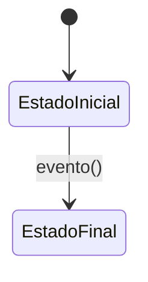

# DDD-NNN: [Título del documento]

---

## Metadatos

| Campo | Valor |
|-------|-------|
| **ID** | DDD-NNN |
| **Nombre** | [Nombre descriptivo] |
| **Fecha** | YYYY-MM-DD |
| **Versión** | 1.0 |
| **Estado** | Borrador |
| **Autor** | [Tu nombre o handle] |
| **Depende de** | DDD-XXX, DDD-YYY (si aplica) |

---

## 1. Resumen

> Una descripción concisa del propósito de este documento.
> ¿Qué define? ¿Qué problema resuelve? ¿Qué aspecto del dominio cubre?

---

## 2. [Sección principal - según el tipo de documento]

### 2.1 [Subsección]

> Contenido de la sección.

### 2.2 [Subsección]

> Contenido de la sección.

---

## 3. [Otra sección]

### 3.1 [Subsección]

> Contenido de la sección.

---

## 4. Tabla de referencias

| Elemento | Descripción | Referencia |
|----------|-------------|------------|
| [Elemento 1] | Descripción | DDD-XXX |

---

## 5. Diagramas

---

## 6. Reglas de negocio

| ID | Regla | Severidad |
|----|-------|-----------|
| RULE-001 | Descripción de la regla | HIGH |

---

## 7. Historial de Cambios

| Versión | Fecha | Autor | Cambios |
|---------|-------|-------|---------|
| 1.0 | YYYY-MM-DD | [Autor] | Creación del documento |

---

*Documento generado como parte del proceso de Domain-Driven Design de Mush2 LabTech.*
