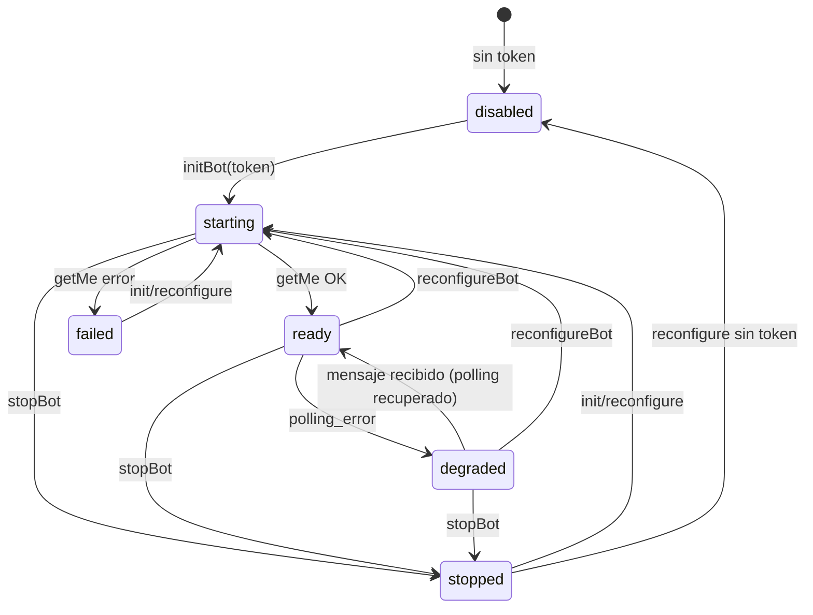

# Telegram Bot Lifecycle — Ciclo de Vida y Observabilidad

**Estado:** Aceptado
**Relacionado:** ADR-032, ADR-033
**Componente:** `backend/src/services/telegramBotService.js`, `backend/src/services/telegramConfigurationService.js`, `backend/src/routes/telegram.js`

---

## Resumen

El bot de Telegram opera como un singleton administrado dentro del backend. Este documento describe su ciclo de vida explícito, la máquina de estados que lo gobierna, el contexto interno del runtime y las garantías que eliminan el error HTTP 409 `terminated by other getUpdates request`.

Desde ISSUE-048 el subsistema está dividido en tres piezas: `telegramConfigurationService.js` (configuración en `SystemSetting` + fallback de entorno), `telegramBotService.js` (runtime, máquina de estados, polling, handlers, envío) y `telegramErrors.js` (clasificación de errores). Este documento describe el comportamiento del **bot service**; el detalle de la separación está en `docs/architecture/telegram-subsystem-architecture.md` y `docs/ADR/ADR-033-telegram-subsystem-split.md`.

No rediseña la integración: la configuración sigue en `SystemSetting` (`telegram_bot_token`, `telegram_bot_username`) con fallback de entorno (`TELEGRAM_BOT_TOKEN`, `TELEGRAM_BOT_USERNAME`), y el vínculo por usuario (`/link` → `UserPreference.telegramChatId`) y la configuración por dispositivo (`TelegramDeviceConfig`) no cambian.

---

## Máquina de estados

Estados expuestos vía `GET /telegram/bot-status` (campo `state`):

| Estado | Significado |
|--------|-------------|
| `disabled` | Sin token configurado. No existe instancia. |
| `starting` | Creando instancia y verificando credenciales (`getMe`). |
| `ready` | Token verificado, polling activo. |
| `degraded` | Ocurrió un `polling_error`. Polling degradado pero **envío operativo** (`running=true`). |
| `stopped` | `stopBot()` completado. Instancia liberada. |
| `failed` | `getMe`/init falló (token inválido, revocado o 403). No hay instancia activa. |

### Diagrama (Mermaid)



### Tabla de transiciones

| Evento | Estado origen | Estado destino | Acción |
|--------|---------------|----------------|--------|
| `initBot`/`reconfigureBot` con token | `disabled` | `starting` | Destroy previo, crear instancia |
| `initBot`/`reconfigureBot` con token | `ready` | `starting` | Destroy previo, crear instancia |
| `initBot`/`reconfigureBot` con token | `degraded` | `starting` | Destroy previo, crear instancia |
| `initBot`/`reconfigureBot` con token | `stopped` | `starting` | Crear instancia |
| `initBot`/`reconfigureBot` con token | `failed` | `starting` | Crear instancia (recuperación obligada vía starting) |
| `reconfigureBot` sin token | cualquier | `disabled` | Destroy + sin instancia |
| `getMe` OK | `starting` | `ready` | Registrar handlers, iniciar polling |
| `getMe` error | `starting` | `failed` | Destroy parcial, registrar error |
| `polling_error` | `ready` | `degraded` | Conservar instancia, `running=true` |
| Mensaje recibido | `degraded` | `ready` | Señal de polling recuperado |
| `stopBot` | `ready`/`degraded` | `stopped` | `await stopPolling()` + liberar |
| `stopBot` | `starting` | `stopped` | Abortar arranque |

**Regla invariante:** no existe transición directa `failed → ready`. Toda recuperación pasa por `starting` (nueva verificación de credenciales).

---

## Runtime Context

El estado interno del bot vive en una única estructura **no exportada** (`runtime`), reemplazando las variables globales dispersas (`bot`, `isReady`, `currentUsername`, `lastError`). El resto del sistema accede solo a través de `getBotStatus()`.

| Campo | Descripción |
|-------|-------------|
| `instance` | Instancia `TelegramBot` activa (o `null`). |
| `generation` | Guard de generación para descartar resultados async obsoletos. |
| `state` | Estado del ciclo de vida. |
| `running` | `true` en `ready` y `degraded`. |
| `username` | Username verificado vía `getMe`. |
| `lastStateChangeAt` | ISO timestamp del último cambio de estado. |
| `startedAt` / `stoppedAt` | Timestamps del último arranque/detención. |
| `lastError` / `lastErrorAt` | Último error y cuándo ocurrió. |
| `reconfigures` | Cantidad de `reconfigureBot()` completados. |
| `messagesSent` / `messagesFailed` | Contadores de envío. |
| `pollingErrors` | Contador de `polling_error`. |
| `lastDeliveryAt` | Última entrega exitosa. |

---

## Serialización y Generation Guard

Todas las operaciones de ciclo de vida (`initBot`, `reconfigureBot`, `stopBot`) se ejecutan a través de una **promise queue** (monomutua). Nunca pueden ejecutarse en paralelo:

```js
let lifecycleQueue = Promise.resolve();

function enqueue(operation) {
  const run = lifecycleQueue.then(operation, operation);
  lifecycleQueue = run.then(() => undefined, () => undefined);
  return run;
}
```

**Generation Guard.** Cada arranque incrementa `runtime.generation`. Si una operación asíncrona antigua termina después de que una nueva ya mutó el runtime, su resultado se descarta (no puede sobrescribir la instancia ni el estado de la generación actual). Los handlers de eventos de una instancia capturan su generación al registrarse: los eventos tardíos (`polling_error`, mensaje de recuperación) de una instancia ya reemplazada se ignoran. La invariancia resultante:

> **Nunca puede existir más de una instancia con polling activo.**

`stopBot` espera `await bot.stopPolling()` antes de liberar la instancia. No se usan `setTimeout`, delays arbitrarios ni reintentos ocultos para sincronizar.

---

## Degradación sin interrupción del envío

Polling y envío son conceptos separados:

- Un `polling_error` (p. ej. 409, 401, pérdida de red) pone `state = degraded` pero **no detiene la instancia**.
- `running` permanece `true`, por lo que `sendMessage`/`sendAlarm` siguen operativos y `GET /telegram/bot-status` siempre responde.
- Si el polling se recupera (llega un mensaje entrante), el estado vuelve a `ready` automáticamente.

---

## Observabilidad expuesta

`GET /telegram/bot-status` (ADMIN) devuelve:

```json
{
  "data": {
    "state": "ready",
    "running": true,
    "username": "@bot",
    "lastError": null,
    "lastStateChangeAt": "2026-08-06T...",
    "startedAt": "2026-08-06T...",
    "stoppedAt": null,
    "lastErrorAt": null,
    "tokenConfigured": true,
    "configuredUsername": "MyMush2Bot",
    "metrics": {
      "messagesSent": 12,
      "messagesFailed": 0,
      "pollingErrors": 1,
      "lastDeliveryAt": "2026-08-06T...",
      "uptimeSeconds": 3600,
      "reconfigures": 2
    }
  }
}
```

`state` es un enum: `disabled | starting | ready | degraded | stopped | failed`.

---

## Decisión: sin retry policy

**TT4 — Decisión:** no se implementa reintento en envíos fallidos. La semántica de entrega se mantiene a un intento por envío (`sendMessage` → un único `bot.sendMessage`). Solo se registran:

- contador `messagesFailed`,
- `lastError`/`lastErrorAt`,
- log estructurado con la causa raíz y el stack.

Esto preserva el comportamiento actual de entrega (CA del ISSUE-047) y deja la puerta abierta a una cola/retry como capacidad futura del subsistema Telegram, sin acoplarla a este cambio.

---

## Logging estructurado

Las transiciones de estado se registran con `STATE_CHANGE` (origen → destino → `running`). Los errores conservan la causa raíz: se intenta `err.original.message` → `err.cause.message` → `err.message`, y se incluye `stack` en `INIT_ERROR`, `SEND_MESSAGE_ERROR`, `STOP_POLLING_ERROR` y `POLLING_ERROR`. No se ocultan excepciones.

Desde ISSUE-048, los logs de `POLLING_ERROR`, `SEND_MESSAGE_ERROR` e `INIT_ERROR` incluyen además `errorKind`, `errorCode` y `retryable` producidos por `classifyTelegramError` (`telegramErrors.js`). La clasificación es **informativa**: no altera las transiciones de estado ni introduce reintentos (se mantiene un intento por envío).

---

## Compatibilidad

- `running`, `username`, `lastError` siguen existiendo en `bot-status` (los consumidores actuales, incluido `frontend/src/features/settings/pages/SystemSettings.jsx`, no se rompen).
- `POST /telegram/configure` sigue siendo idempotente y no introduce variables de entorno nuevas.
- `/link`, `/status`, `/unlink` y la configuración por dispositivo (`TelegramDeviceConfig`) no cambian.
