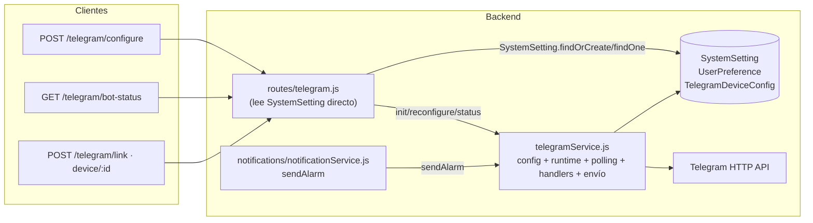
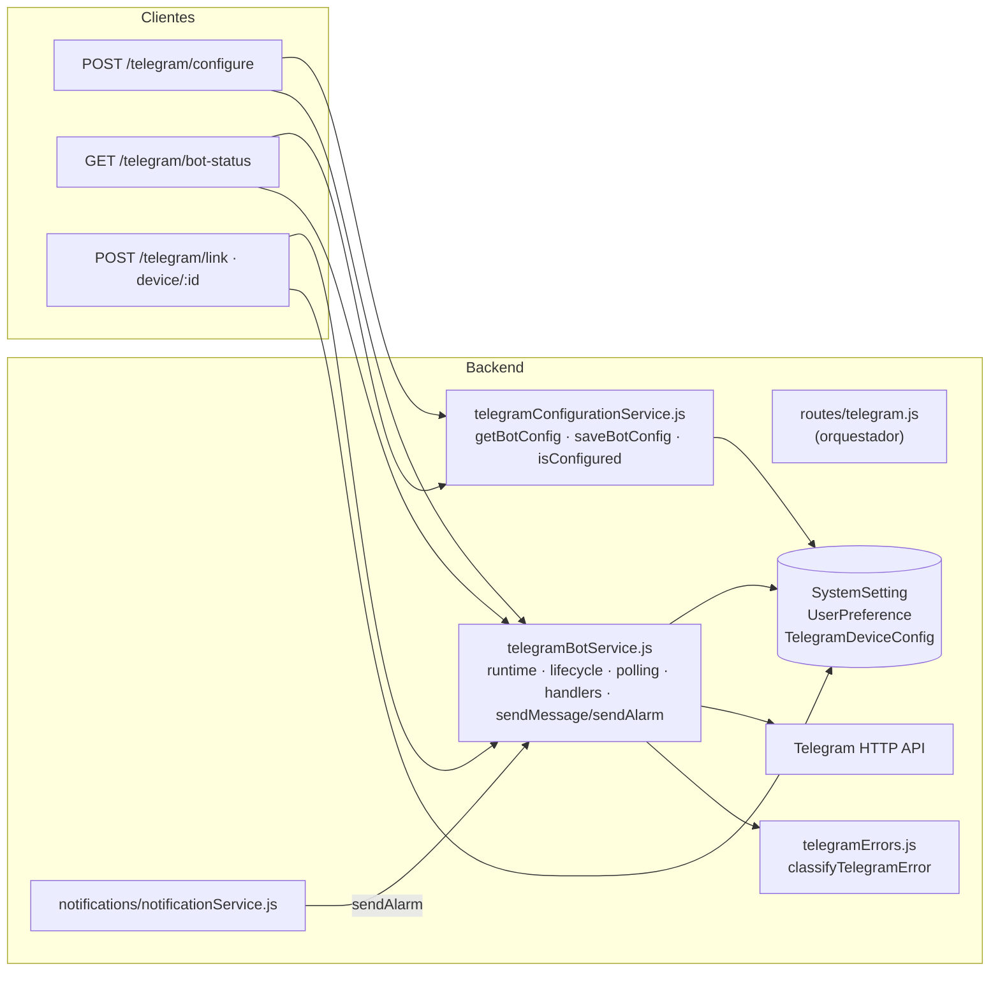

# Telegram Subsystem Architecture — Arquitectura del Subsistema

**Estado:** Aceptado
**Relacionado:** ISSUE-048, ADR-033, `docs/architecture/telegram-bot-lifecycle.md`

---

## Resumen

El subsistema Telegram del backend está formado por tres servicios de responsabilidad única y las rutas REST que los exponen. Este documento describe la arquitectura anterior (monolito), la nueva (separada), el inventario de responsabilidades y el flujo de dependencias.

**Regla de oro (ISSUE-048):** refactor con comportamiento observable idéntico. No cambian endpoints, payloads ni flujos funcionales.

---

## Arquitectura anterior (monolito)



Problemas de la arquitectura anterior:

- `telegramService.js` mezclaba **configuración y ejecución** (leía `SystemSetting` y administraba la instancia `TelegramBot`).
- La persistencia del token/username se duplicaba entre `server.js` y `routes/telegram.js`.
- La clasificación de errores era heurística y ad hoc, repetida en cada `catch`.
- `notificationService` dependía del monolito para `sendAlarm`.

---

## Arquitectura nueva (separada)



Reglas de dependencia:

- `telegramBotService` **no** lee `SystemSetting`: la configuración llega por parámetro (resuelta por el caller con `telegramConfigurationService`).
- `telegramConfigurationService` **no** conoce `TelegramBot` ni administra runtime.
- `telegramErrors` es puro (sin dependencias de negocio) y se usa dentro del bot service para enriquecer logs.

---

## Inventario de responsabilidades

### Antes (`telegramService.js`)

| Responsabilidad | ¿Estaba bien ubicada? |
|---|---|
| Leer/guardar token y username en `SystemSetting` | ❌ mezclada |
| Verificar credenciales (`getMe`) | ⚠️ aceptable |
| Crear instancia y polling | ✅ |
| Máquina de estados y runtime | ✅ (ISSUE-047) |
| Promise queue + Generation Guard | ✅ (ISSUE-047) |
| Handlers `/start`, `/link`, `/status`, `/unlink` | ✅ |
| `sendMessage` / `sendAlarm` | ✅ |
| Clasificar errores Telegram | ❌ heurística ad hoc |

### Después

| Módulo | Responsabilidades |
|---|---|
| **telegramConfigurationService.js** | Obtener config (`getBotConfig`), guardar config (`saveBotConfig`), validar existencia (`isConfigured`), leer `SystemSetting`, aplicar fallbacks `TELEGRAM_BOT_TOKEN` / `TELEGRAM_BOT_USERNAME`. No runtime, no bot, no polling, no envío. |
| **telegramBotService.js** | Runtime, ciclo de vida, máquina de estados, polling, handlers, Generation Guard, promise queue, observabilidad, métricas, `sendMessage`, `sendAlarm`, `initBot`, `stopBot`, `reconfigureBot`, `getBotStatus`, `isBotReady`. No lee `SystemSetting`. |
| **telegramErrors.js** | `classifyTelegramError(error)` → `{ kind, code, retryable, stateEffect }` (401, 403, 409, 429, timeout, red, 5xx, internos). No reintenta, no cambia transiciones. |

---

## Flujo de dependencias

```
server.js
  └─ telegramConfigurationService.getBotConfig()   → { token, username }
  └─ telegramBotService.initBot(token, username)   → arranca el bot

routes/telegram.js
  POST /configure
    └─ telegramConfigurationService.saveBotConfig({ token, username })
    └─ telegramConfigurationService.getBotConfig()
    └─ telegramBotService.reconfigureBot(token, username)
  GET /bot-status
    └─ telegramBotService.getBotStatus()
    └─ telegramConfigurationService.getBotConfig()  → storedToken/storedUsername

notifications/notificationService.js
  └─ telegramBotService.sendAlarm(chatId, alarm, device)
```

La configuración siempre se resuelve en el **caller** (ruta o arranque) y se inyecta al bot service por parámetro.

---

## Clasificación de errores (`telegramErrors.js`)

| Condición | `kind` | `retryable` | `stateEffect` |
|---|---|---|---|
| HTTP 401 | `INVALID_TOKEN` | false | failed |
| HTTP 403 | `FORBIDDEN` | false | failed |
| HTTP 409 | `POLLING_CONFLICT` | true | degraded |
| HTTP 429 | `RATE_LIMITED` | true | degraded |
| Timeout / red | `NETWORK_ERROR` | true | degraded |
| HTTP 5xx | `TELEGRAM_5XX` | true | degraded |
| Otro 4xx | `TELEGRAM_API_ERROR` | false | degraded |
| Sin código | `INTERNAL_ERROR` | false | unknown |

La clasificación es **informativa** (logs con `errorKind`/`errorCode`/`retryable`). No implementa retries y no modifica la semántica de envío ni las transiciones de estado (ver `docs/architecture/telegram-bot-lifecycle.md`).

---

## Compatibilidad

- `GET /telegram/bot-status` — payload idéntico (`state`, `running`, `username`, `lastError`, `metrics`, `tokenConfigured`, `configuredUsername`).
- `POST /telegram/configure` — idempotente; persiste y arranca igual que antes.
- `sendAlarm()` / `sendMessage()` — mismas firmas y semántica.
- Frontend — sin cambios.

---

## Preparación para capacidades futuras

Sin acoplarse a este refactor, la arquitectura queda lista para incorporar posteriormente:

- webhooks oficiales de Telegram (reemplazo de polling);
- colas de mensajes y políticas de reintento;
- proveedores de notificación múltiples;
- notificaciones enriquecidas e imágenes;
- comandos administrativos.

Estas capacidades NO forman parte de este ISSUE.
